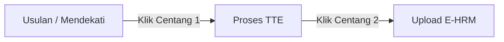

# Buku Panduan Penggunaan Sistem (User Manual)
## Dashboard Kepegawaian & Notifikasi Otomatis (KGB, KP, KJ, Tubel, Diklat, Ukom)

Selamat datang di Buku Panduan Penggunaan Aplikasi **Dashboard Kepegawaian**. Panduan ini disusun menggunakan bahasa yang sederhana, panduan langkah-demi-langkah yang rinci, serta penjelasan istilah agar mudah dipahami oleh seluruh petugas administrasi kepegawaian (baik Admin baru maupun senior).

---

## Daftar Isi
1. [BAB 1: Pendahuluan & Gambaran Umum](#bab-1-pendahuluan--gambaran-umum)
   - [1.1 Latar Belakang (Mengapa Aplikasi Ini Dibuat?)](#11-latar-belakang-mengapa-aplikasi-ini-dibuat)
   - [1.2 Tujuan Aplikasi (Apa Manfaatnya?)](#12-tujuan-aplikasi-apa-manfaatnya)
   - [1.3 Hak Akses Pengguna (Siapa yang Bisa Menggunakan?)](#13-hak-akses-pengguna-siapa-yang-bisa-menggunakan)
2. [BAB 2: Fitur & Panduan Penggunaan Modul Kepegawaian](#bab-2-fitur--panduan-penggunaan-modul-kepegawaian)
   - [2.1 Halaman Utama Dashboard (Tampilan Awal & Tombol Sinkronisasi)](#21-halaman-utama-dashboard-tampilan-awal--tombol-sinkronisasi)
   - [2.2 Siklus Alur Status & Panduan Tombol Centang (Usulan -> Proses TTE -> Upload e-HRM)](#22-siklus-alur-status--panduan-tombol-centang-usulan---proses-tte---upload-e-hrm)
   - [2.3 Modul Kenaikan Gaji Berkala (KGB)](#23-modul-kenaikan-gaji-berkala-kgb)
   - [2.4 Modul Kenaikan Pangkat (KP)](#24-modul-kenaikan-pangkat-kp)
   - [2.5 Modul Kenaikan Jenjang (KJ) & Cetak Surat Usulan](#25-modul-kenaikan-jenjang-kj--cetak-surat-usulan)
   - [2.6 Modul Uji Kompetensi (UKOM)](#26-modul-uji-kompetensi-ukom)
   - [2.7 Modul Tugas Belajar (TUBEL) & Progress Alur Berkas](#27-modul-tugas-belajar-tubel--progress-alur-berkas)
   - [2.8 Modul Pendidikan & Keahlian (Diklat & Sertifikat Bermasalah)](#28-modul-pendidikan--keahlian-diklat--sertifikat-bermasalah)
3. [BAB 3: Fitur & Panduan Halaman Manajemen Data](#bab-3-fitur--panduan-halaman-manajemen-data)
   - [3.1 Panduan Mencari dan Melihat Data Pegawai](#31-panduan-mencari-dan-melihat-data-pegawai)
   - [3.2 Panduan Manajemen Akun Admin (Daftar Admin)](#32-panduan-manajemen-akun-admin-daftar-admin)
   - [3.3 Panduan Keamanan (Ganti Kata Sandi & Lupa Sandi)](#33-panduan-keamanan-ganti-kata-sandi--lupa-sandi)
   - [3.4 Panduan Log Aktivitas (Catatan Kerja Admin & Cetak PDF)](#34-panduan-log-aktivitas-catatan-kerja-admin--cetak-pdf)
   - [3.5 Panduan Backup Database (Pencadangan Data Sekali Klik)](#35-panduan-backup-database-pencadangan-data-sekali-klik)
4. [BAB 4: Alur Logika & Cara Kerja Pelacakan (Penjelasan Sistem di Latar Belakang)](#bab-4-alur-logika--cara-kerja-pelacakan-penjelasan-sistem-di-latar-belakang)
   - [4.1 Apa itu Sinkronisasi Data e-HRM?](#41-apa-itu-sinkronisasi-data-e-hrm)
   - [4.2 Bagaimana Sistem Menentukan Kelayakan Pegawai secara Otomatis?](#42-bagaimana-sistem-menentukan-kelayakan-pegawai-secara-otomatis)
5. [BAB 5: Panduan Konfigurasi Template & Pesan Notifikasi](#bab-5-panduan-konfigurasi-template--pesan-notifikasi)
   - [5.1 Cara Mengubah Template Pesan Email Otomatis](#51-cara-mengubah-template-pesan-email-otomatis)
   - [5.2 Cara Mengirim Email Pengingat Manual ke Pegawai](#52-cara-mengirim-email-pengingat-manual-ke-pegawai)
6. [BAB 6: Troubleshooting & FAQ (Tanya Jawab Masalah Umum)](#bab-6-troubleshooting--faq-tanya-jawab-masalah-umum)

---

## BAB 1: Pendahuluan & Gambaran Umum

Aplikasi **Dashboard Kepegawaian** adalah sebuah sistem pembantu digital yang dibuat khusus untuk mempermudah tugas Admin Kepegawaian di lingkungan Pusdatin Kementerian PUPR. 

Sistem ini bertindak seperti "asisten pintar" yang memantau dokumen, masa berlaku, dan persyaratan administratif seluruh pegawai agar hak-hak pegawai (seperti kenaikan gaji atau pangkat) tidak terlambat diproses.

### 1.1 Latar Belakang (Mengapa Aplikasi Ini Dibuat?)
Selama ini, pemantauan berkas pegawai seperti kapan jadwal Kenaikan Gaji Berkala (KGB), Kenaikan Pangkat, maupun kelengkapan berkas setelah Tugas Belajar seringkali dilakukan secara manual menggunakan catatan kertas atau Microsoft Excel. Cara manual ini memiliki kelemahan:
1.  **Terlambat / Telat:** Pengurusan berkas dan hak-hak pegawai (seperti kenaikan gaji berkala atau pangkat) berisiko terlambat diproses.
2.  **Terlewat:** Jadwal penting kepegawaian berisiko terlewat begitu saja tanpa disadari karena tidak adanya pengingat otomatis.
3.  **Tidak Terinformasi (Harus Cek 1-per-1):** Admin tidak mendapatkan informasi secara langsung jika ada dokumen pegawai yang kurang lengkap, sehingga Admin terpaksa harus memeriksa satu per satu data seluruh pegawai secara manual.

Dengan adanya sistem ini, semua pemantauan tersebut dihitung secara otomatis oleh sistem komputer yang terhubung langsung dengan data pusat e-HRM Kementerian PUPR.

### 1.2 Tujuan Aplikasi (Apa Manfaatnya?)
*   **Mengingatkan Secara Otomatis:** Sistem akan mengirim email pengingat kepada pegawai jika ada dokumen mereka yang kurang atau saat waktu KGB mereka tiba.
*   **Peta Pantau Tunggal (Dashboard):** Admin cukup melihat satu layar halaman utama untuk mengetahui pegawai mana saja yang berkasnya bermasalah.
*   **Deteksi Cepat:** Membantu mendeteksi sertifikat Diklat pegawai yang belum diunggah atau tidak memiliki nomor sertifikat resmi.

### 1.3 Hak Akses Pengguna (Siapa yang Bisa Menggunakan?)
Aplikasi ini hanya dapat diakses oleh petugas kepegawaian resmi melalui akun yang terdaftar. Ada 2 tingkat akun (Role):
1.  **Super Admin (Kepala / Penanggung Jawab IT)**:
    *   Bisa mengakses semua fitur tanpa batasan.
    *   Bisa menambah atau menghapus akun Admin lain.
    *   Bisa mengubah kata-kata template pesan email otomatis.
    *   Bisa melakukan backup (cadangan) data database.
2.  **Admin Pegawai (Staf Kepegawaian)**:
    *   Bisa melihat seluruh dashboard pegawai.
    *   Bisa membuka profil pegawai dan memeriksa berkas dokumen.
    *   Bisa mengirim email teguran/pengingat ke pegawai secara manual.
    *   Bisa mencetak surat usulan.

---

## BAB 2: Fitur & Panduan Penggunaan Modul Kepegawaian

### 2.1 Halaman Utama Dashboard (Tampilan Awal & Tombol Sinkronisasi)
Saat pertama kali Anda masuk (login) ke dalam aplikasi, Anda akan melihat halaman Dashboard Utama.

#### **Bagian-bagian Penting Layar Utama:**
1.  **Kotak Informasi Statistik (Atas):**
    *   **Total Pegawai:** Jumlah total pegawai Pusdatin yang terdaftar saat ini.
    *   **Tingkat Kepatuhan:** Persentase kelengkapan berkas pegawai. Semakin tinggi angkanya, semakin tertib administrasi pegawai.
    *   **Tenggat Mendesak:** Jumlah pegawai yang berkasnya harus segera diproses hari ini.
2.  **Sidebar Kiri (Menu Navigasi):**
    *   Digunakan untuk berpindah halaman (Dashboard, Data Pegawai, Konfigurasi Pesan, Log Aktivitas, dll).
    *   **Tombol "Sinkronisasi" (Paling Bawah Sidebar):** Tombol berwarna abu-abu dengan ikon panah melingkar. Klik tombol ini untuk menarik data terbaru dari sistem pusat e-HRM secara langsung saat itu juga.
3.  **Lonceng Notifikasi (Pojok Kanan Atas):**
    *   Klik ikon lonceng untuk melihat daftar aktivitas terbaru yang baru saja terjadi.
4.  **Daftar Tugas Berbentuk Accordion (Tengah Halaman):**
    *   Berisi daftar nama pegawai yang dikelompokkan dalam kategori: *Kenaikan Pangkat, Kenaikan Jenjang, KGB, Tugas Belajar, Diklat, Ukom*.
    *   **Cara Membuka Daftar**: Cukup klik pada judul kategori (misal klik tulisan "Kenaikan Gaji Berkala (KGB)") maka daftar nama pegawai di dalamnya akan terbuka ke bawah.

---

### 2.2 Siklus Alur Status & Panduan Tombol Centang (Usulan -> Proses TTE -> Upload e-HRM)
Untuk kategori usulan seperti **KGB** dan **Kenaikan Pangkat**, proses administrasinya mengikuti alur berkas di dunia nyata yang dibagi menjadi 3 tahap status di dashboard.

Admin dapat mengubah status ini secara berurutan menggunakan **tombol centang biru** di kolom aksi (paling kanan tabel).

#### **Detail Kapan Harus Mengklik Tombol Centang:**

1.  **Tahap 1: Status `Usulan` atau `Mendekati`**
    *   **Arti Status**: Pegawai telah memenuhi syarat untuk KGB atau naik pangkat, berkas sedang mulai disiapkan oleh Admin di kantor.
    *   **Kapan Harus Klik Centang?** Ketika Admin **telah selesai membuat draf surat usulan** dan mengirimkannya ke pimpinan/kepala untuk ditandatangani.
    *   **Tindakan**: Klik tombol **Centang Biru** pada baris pegawai tersebut.
    *   **Hasil**: Status pegawai akan berubah menjadi **Proses TTE** (Warna Kuning).

2.  **Tahap 2: Status `Proses TTE`**
    *   **Arti Status**: Surat usulan saat ini sedang menunggu tanda tangan elektronik (TTE) resmi dari pimpinan/kepala dinas.
    *   **Kapan Harus Klik Centang?** Ketika Admin **menerima kabar/notifikasi bahwa surat usulan telah selesai ditandatangani secara digital (TTE selesai)** oleh pimpinan.
    *   **Tindakan**: Klik tombol **Centang Biru** sekali lagi pada baris nama pegawai tersebut. Sistem akan memunculkan kotak konfirmasi kecil, klik **"Ya, Konfirmasi"**.
    *   **Hasil**: Status pegawai akan berubah menjadi **Upload E-HRM** (Warna Hijau).

3.  **Tahap 3: Status `Upload E-HRM`**
    *   **Arti Status**: Surat resmi yang sudah bertanda tangan lengkap siap diunggah ke sistem e-HRM pusat agar tercatat di database kementerian.
    *   **Kapan Harus Klik Centang?** Di tahap ini, tombol centang sudah hilang karena ini merupakan status akhir pelacakan. Admin tinggal mengunggah dokumen tersebut ke web e-HRM pusat. Nama pegawai akan hilang otomatis dari dashboard pada jadwal sinkronisasi berikutnya setelah data e-HRM pusat terbarui.

---

### 2.3 Modul Kenaikan Gaji Berkala (KGB)
Modul ini membantu melacak pegawai yang berhak mendapatkan Kenaikan Gaji Berkala.

*   **Tampilan Kolom Status**: Memperlihatkan status keaktifan pengajuan (`Usulan`, `Proses TTE`, atau `Upload E-HRM`).
*   **Langkah Admin**: 
    1. Buka accordion **Kenaikan Gaji Berkala (KGB)**.
    2. Cari nama pegawai yang KGB-nya jatuh tempo.
    3. Klik tombol **Cetak Surat** untuk membuat draf surat KGB.
    4. Setelah surat diajukan ke atasan, klik **Centang Biru** pertama untuk mengubah status ke `Proses TTE`.
    5. Setelah TTE selesai ditandatangani kepala, klik **Centang Biru** kedua untuk mengubah status ke `Upload E-HRM` (tahap akhir).

---

### 2.4 Modul Kenaikan Pangkat (KP)
Melacak usulan kenaikan golongan/pangkat pegawai.

#### **3 Kategori Kenaikan Pangkat:**
1.  **Reguler (Staf/Pelaksana):** Dihitung otomatis setiap 4 tahun sekali sejak tanggal pangkat terakhirnya.
2.  **Struktural (Pejabat Eselon):** Dihitung berdasarkan pangkat minimum yang wajib dimiliki untuk jabatan eselon tersebut.
3.  **Fungsional (Jafung):** Dihitung berdasarkan kecukupan syarat Angka Kredit (AK) kumulatif pegawai bersangkutan di database.

#### **Langkah-langkah Tindakan Admin:**
1.  Buka bilah accordion **Kenaikan Pangkat (KP)**.
2.  Pilih sub-tab yang sesuai (Reguler, Struktural, atau Fungsional).
3.  Ikuti alur perubahan status (klik tombol centang biru secara berjenjang dari `Usulan` $\rightarrow$ `Proses TTE` $\rightarrow$ `Upload E-HRM` seperti dijelaskan pada **Bab 2.2** seiring dengan perkembangan berkas fisik di kantor).

---

### 2.5 Modul Kenaikan Jenjang (KJ) & Cetak Surat Usulan
Memantau pejabat fungsional yang sudah layak untuk naik tingkat jabatan ke jenjang yang lebih tinggi (contoh: dari Ahli Pertama ke Ahli Muda).

#### **Langkah-langkah Tindakan Admin:**
1.  Buka accordion **Kenaikan Jenjang (KJ)**.
2.  Klik ikon **Mata** (Detail) di sebelah kanan nama pegawai untuk memastikan seluruh Angka Kreditnya sudah mencukupi.
3.  Jika berkas sudah lengkap, klik tombol **"Daftarkan UKOM"** untuk mengirim data pegawai tersebut ke modul Uji Kompetensi.
4.  **Cetak Surat Usulan KJ & Upload Lampiran:** 
    *   Klik tombol **"Cetak Surat"** (warna biru) pada nama pegawai untuk membuka modal pembuatan Nota Dinas.
    *   **Langkah 1 & 2 (Pilih Pengirim/Penerima):** Tentukan pejabat penandatangan dan nomor surat.
    *   **Langkah 3 (Kelola Dokumen Lampiran):** Ketik judul lampiran (misal: *Sertifikat Ukom BKN*), klik tombol **Pilih File** (pilih file PDF/Gambar dari komputer Anda), lalu klik **Upload**.
    *   **Mengatur Lampiran:** Anda bisa menyeret (*drag-and-drop*) daftar file untuk mengurutkannya, mengedit judul lampiran dengan mengklik nama file, atau menghapusnya jika salah upload.
    *   **Unduh Dokumen:** Klik tombol **"Generate Bundle"** untuk mencetak draf surat usulan beserta seluruh berkas lampiran yang telah diunggah dalam satu file PDF ringkas.

---

### 2.6 Modul Uji Kompetensi (UKOM)
Modul ini berisi daftar pegawai yang sedang atau telah mengikuti ujian kompetensi sebagai syarat mutlak kenaikan jenjang jabatannya.

#### **Langkah-langkah Tindakan Admin:**
1.  Buka accordion **Uji Kompetensi (UKOM)**.
2.  Setelah hasil ujian pegawai keluar, klik tombol aksi di kolom paling kanan:
    *   Pilih **"Lulus"** jika pegawai dinyatakan lulus ujian. Pegawai akan otomatis dikembalikan ke modul Kenaikan Jenjang (KJ) dengan status siap diproses (`Usulan`).
    *   Pilih **"Tidak Lulus"** jika pegawai gagal. Pegawai akan tetap berada di daftar UKOM dengan catatan keterangan tidak lulus.

---

### 2.7 Modul Tugas Belajar (TUBEL) & Progress Alur Berkas
Modul ini memantau pegawai Pusdatin yang sedang menempuh pendidikan sekolah (Tugas Belajar).

#### **Tampilan Progress Alur Berkas (Timeline):**
Saat Anda mengklik ikon **Mata** (Detail) pada pegawai kategori Tubel, modal profil akan terbuka menampilkan grafik alur pengaktifan kembali:

#### **Cara Membaca & Tindakan Admin:**
1.  **Grafik Alur (Timeline):** Menunjukkan tahapan berkas yang harus dilalui oleh pegawai dari mulai sekolah, lulus, hingga pengajuan SK Pengaktifan Kembali.
2.  **Alarm Sisa Waktu:** Jika sisa masa tugas belajar pegawai tinggal **60 hari lagi**, status otomatis berubah menjadi `Proses Pengaktifan` (Warna Merah).
3.  **Tindakan Staf Admin:** Segera hubungi pegawai tersebut untuk mengirim berkas Surat Pengantar Unit Kerja, SK Tugas Belajar, dan Ijazah kelulusannya guna pembuatan SK Pengaktifan Kembali sebagai pegawai aktif.

---

### 2.8 Modul Pendidikan & Keahlian (Diklat & Sertifikat Bermasalah)
Modul ini sangat penting untuk memantau apakah pegawai tertib mengupload berkas sertifikat diklat/pelatihan yang telah mereka ikuti ke sistem e-HRM pusat.

#### **Cara Membuka Detail Masalah Diklat:**
1.  Buka accordion **Pendidikan & Keahlian (Diklat)** di Dashboard.
2.  Klik tombol **Mata** (Detail) di sebelah kanan nama pegawai. Jendela pop-up detail akan terbuka seperti berikut:

#### **Bagian-bagian Pop-up Detail Diklat:**
1.  **Kotak Peringatan (Banner Oranye):** Di bagian atas tertulis kalimat seperti *"Terdapat 1 diklat yang tidak memiliki berkas..."*. Jumlah ini akan berubah otomatis sesuai jumlah sertifikat bermasalah milik pegawai tersebut:

2.  **Tabel Riwayat Pelatihan:**
    *   Kolom **Arsip**: Menunjukkan ketersediaan berkas di folder lokal instansi.
    *   Kolom **Arsip BPSDM**: Menunjukkan ketersediaan berkas di database BPSDM pusat.
    *   Jika tertulis **"Tidak Ada"** dengan warna merah, berarti berkas tersebut belum diunggah.
3.  **Avatar Inisial (Pojok Kiri Atas):** Menampilkan inisial nama pegawai secara otomatis (contoh: `MI` untuk Muhammad Ihsan).
4.  **Badge Biru Premium:** Menampilkan kategori modul yaitu `"PENDIDIKAN DAN KEAHLIAN"`.
5.  **Tombol Kuning "Kirim Pengingat" (Kanan Bawah):** Klik tombol ini jika Anda ingin mengirimkan email teguran langsung ke pegawai agar segera mengunggah berkas sertifikat diklat yang berwarna merah ("Tidak Ada") tersebut.

---

## BAB 3: Fitur & Panduan Halaman Manajemen Data

### 3.1 Panduan Mencari dan Melihat Data Pegawai
Menu **Data Pegawai** di sidebar kiri digunakan untuk melihat basis data seluruh pegawai secara keseluruhan.

#### **Langkah-langkah Pencarian:**
1.  Klik menu **Data Pegawai** pada sidebar kiri.
2.  Ketik nama pegawai atau nomor NIP pada kolom pencarian di bagian atas.
3.  Klik tombol **Cari**. Hasil pencarian akan langsung muncul di tabel.
4.  Klik nama pegawai untuk membuka halaman profil lengkap pegawai tersebut.

---

### 3.2 Panduan Manajemen Akun Admin (Daftar Admin)
Menu **Daftar Admin** hanya dapat diakses oleh **Super Admin** untuk mengatur siapa saja staf yang boleh mengoperasikan aplikasi ini.

#### **Cara Menambah Admin Baru:**
1.  Klik menu **Daftar Admin** pada sidebar kiri.
2.  Klik tombol **Tambah Admin** (biasanya berada di pojok kanan atas).
3.  Isi formulir yang muncul:
    *   **Nama Lengkap / Username**
    *   **Alamat Email Aktif**
    *   **Kata Sandi (Password) Awal**
    *   **Peran (Role):** Pilih *Super Admin* atau *Admin Pegawai*.
4.  Klik **Simpan**. Akun baru kini sudah bisa digunakan untuk login.

#### **Cara Menghapus Admin:**
1.  Temukan nama admin yang ingin dihapus pada tabel Daftar Admin.
2.  Klik tombol tempat sampah merah (**Hapus**).
3.  Pilih **Ya, Hapus** pada kotak konfirmasi keamanan yang muncul.

---

### 3.3 Panduan Keamanan (Ganti Kata Sandi & Lupa Sandi)
Demi menjaga keamanan data kepegawaian Pusdatin KemenPU, terdapat beberapa fitur pengaman kata sandi:

#### **A. Mengubah Kata Sandi Melalui Aplikasi:**
1.  Klik foto profil / inisial nama Anda di pojok kanan atas layar.
2.  Pilih opsi **"Ganti Kata Sandi"**.
3.  Ketik kata sandi lama Anda, lalu masukkan kata sandi baru sebanyak dua kali sebagai konfirmasi.
4.  Klik **Simpan**. Sandi baru Anda langsung aktif.

#### **B. Fitur Wajib Ganti Sandi (Force Change Password):**
*   Jika akun Anda baru dibuat oleh Super Admin, atau sandi Anda baru saja disetel ulang, sistem akan secara otomatis mengunci menu utama dan menampilkan layar **"Wajib Ganti Kata Sandi"** sesaat setelah Anda login.
*   Anda diharuskan memasukkan kata sandi kustom baru sebelum sistem memperbolehkan Anda masuk ke Dashboard. Hal ini bertujuan agar sandi awal buatan Super Admin tidak disalahgunakan.

#### **C. Pemulihan Sandi (Lupa Kata Sandi):**
1.  Di layar login utama, klik tautan tulisan biru **"Lupa Kata Sandi?"**.
2.  Masukkan alamat email dinas Anda yang terdaftar pada aplikasi.
3.  Klik tombol **"Kirim Link Reset"**.
4.  Buka kotak masuk email Anda, klik tautan link pemulihan yang dikirim oleh sistem, lalu ketikkan kata sandi baru Anda di halaman web reset sandi yang muncul.

---

### 3.4 Panduan Log Aktivitas (Catatan Kerja Admin & Cetak PDF)
Menu **Log Aktivitas** berfungsi mencatat seluruh riwayat pengerjaan yang dilakukan oleh para admin ke dalam sistem. Ini berguna untuk memantau kinerja staf dan melacak jika ada kesalahan klik/proses.

#### **Cara Membaca & Mengunduh Log:**
1.  Klik menu **Log Aktivitas** di sidebar kiri.
2.  Tabel akan menampilkan secara kronologis siapa nama adminnya, apa aktivitas yang dilakukan (misal: "Mengirim email pengingat manual ke Budi"), dan kapan waktu kejadiannya.
3.  **Cetak PDF:** Klik tombol **"Ekspor PDF"** (ikon dokumen merah) di pojok kanan atas untuk mengunduh seluruh catatan aktivitas ke dalam bentuk berkas PDF untuk bahan laporan ke pimpinan.

---

### 3.5 Panduan Backup Database (Pencadangan Data Sekali Klik)
Pencadangan (backup) data wajib dilakukan secara berkala (misalnya sebulan sekali) agar data aplikasi tidak hilang jika komputer server mengalami kerusakan.

#### **Langkah-langkah Melakukan Backup:**
1.  Pastikan Anda login menggunakan akun **Super Admin**.
2.  Lihat menu sidebar kiri paling bawah, klik tombol **"Backup Database"**.
3.  Proses download akan otomatis berjalan di browser Anda menghasilkan berkas dengan ekstensi `.sql` (contoh: `backup_db_kepegawaian_2026.sql`).
4.  Simpan berkas tersebut di flashdisk atau Google Drive dinas dengan aman.

---

## BAB 4: Alur Logika & Cara Kerja Pelacakan (Penjelasan Sistem di Latar Belakang)

Bagian ini menjelaskan secara sederhana bagaimana komputer di latar belakang bekerja melakukan perhitungan otomatis tanpa perlu intervensi manual dari Admin.

### 4.1 Apa itu Sinkronisasi Data e-HRM?
Aplikasi kita tidak menyimpan data kepegawaian secara mandiri dari nol, melainkan mengambil data milik kementerian pusat yang berada di sistem **e-HRM Kementerian PUPR** melalui sambungan jaringan internet (API).
*   **Proses Sinkronisasi Otomatis:** Setiap tengah malam pukul 00:00, ketika kantor sedang sepi, komputer server kita akan "berbicara" dengan server pusat untuk menyalin data perubahan pangkat, jabatan, atau riwayat pelatihan pegawai terbaru ke dalam database lokal kita.
*   **Proses Sinkronisasi Manual:** Jika ada pegawai yang baru saja mengupload dokumen di e-HRM pusat dan ingin datanya langsung muncul di aplikasi saat itu juga, Admin cukup menekan tombol **"Sinkronisasi"** di pojok kiri bawah layar.

### 4.2 Bagaimana Sistem Menentukan Kelayakan Pegawai secara Otomatis?
Setelah data berhasil disinkronkan, sistem pintar kita akan menjalankan rumus matematika berikut secara otomatis:
*   **Logika KGB:** Tanggal TMT KGB terakhir pegawai ditambah 2 tahun. Jika hasilnya menunjukkan sisa waktu 60 hari lagi, pegawai dimasukkan status `Mendekati`. Jika hari ini sudah melewati tanggal tersebut, status otomatis diubah menjadi `Usulan`.
*   **Logika KP Reguler:** Menghitung selisih tahun dari TMT Golongan terakhir pegawai. Jika selisihnya $\ge 4$ tahun, nama pegawai akan otomatis dimunculkan di tab `Usulan KP Reguler`.
*   **Logika Diklat:** Menyaring seluruh riwayat diklat pegawai yang status kelulusannya bernilai `Lulus`, namun kolom unggahan sertifikat fisiknya kosong di server pusat. Jika ditemukan, sistem langsung menaikkan nama pegawai tersebut ke daftar kepatuhan bermasalah di dashboard.

---

## BAB 5: Panduan Konfigurasi Template & Pesan Notifikasi

### 5.1 Cara Mengubah Template Pesan Email Otomatis
Email pengingat yang dikirim oleh sistem memiliki kalimat bawaan (template). Super Admin dapat menyesuaikan tata bahasa email tersebut agar lebih sopan dan resmi.

#### **Langkah-langkah Mengubah Template:**
1.  Masuk ke menu **Konfigurasi Pesan** di sidebar kiri.
2.  Cari kategori pesan yang ingin diubah (contoh: *Diklat Upload Dokumen*).
3.  Klik tombol **Edit** (ikon pensil biru) di ujung kanan.
4.  Ketik kalimat baru pada kotak teks yang disediakan.
5.  **PENTING (Aturan Kode Penanda):** Jangan menghapus atau merusak teks di dalam kurung kurawal seperti `{nama}`, `{nip}`, atau `{detail_diklat}` karena kode tersebut akan otomatis digantikan oleh sistem dengan nama and NIP asli pegawai saat email dikirim.
6.  Klik **Simpan**.

---

### 5.2 Cara Mengirim Email Pengingat Manual ke Pegawai
Fitur ini sangat berguna jika Admin ingin mengirimkan teguran email langsung ke satu orang pegawai secara personal dengan teks pesan yang bisa kita ubah sesuka hati secara langsung.

#### **Langkah-demi-Langkah Penggunaan:**
1.  Buka profil detail pegawai bermasalah (misal di modal detail Diklat) lalu klik tombol kuning **"Kirim Pengingat"**.
2.  Jendela pop-up **Kirim Pengingat Manual** akan muncul di layar.
3.  **Pilih Template:** Klik dropdown *"PILIH TEMPLATE PESAN"* dan pilih kategori yang sesuai (misalnya: *Diklat Upload Dokumen*).
4.  **Lihat Preview:** Teks draf email akan otomatis terisi di dalam kotak besar di bawahnya. Semua kode `{nama}`, `{nip}`, dan daftar diklat bermasalah milik pegawai tersebut sudah diterjemahkan secara otomatis oleh sistem menjadi data asli.
5.  **Cara Mengedit Isi Teks:** 
    *   Secara bawaan, teks draf tersebut terkunci (berwarna abu-abu) agar tidak tidak sengaja terhapus.
    *   Jika Anda ingin menambah atau mengubah kalimatnya secara manual, **klik kotak centang (checkbox) biru** di bagian tengah bertuliskan *"Gunakan pesan custom atau edit manual?"*.
    *   Teks di dalam kotak besar kini akan berubah menjadi aktif (berwarna putih) dan siap diketik/edited sesuai kebutuhan Anda.
6.  **Kirim Email:** Jika teks pesan dirasa sudah pas, klik tombol biru **"Kirim Pesan"** di pojok kanan bawah. Email akan langsung masuk antrean pengiriman sistem.

---

## BAB 6: Troubleshooting & FAQ (Tanya Jawab Masalah Umum)

**Q: Saya sudah klik tombol "Kirim Pesan" pengingat manual, tapi mengapa pegawai melapor belum menerima email di kotak masuknya?**
*   *Jawaban:* Sistem kami menggunakan teknologi antrean (*queue system*) agar jalannya aplikasi utama tetap cepat dan tidak lambat saat mengirim banyak email sekaligus. Mohon tunggu 1 hingga 3 menit. Pastikan juga koneksi internet server dalam keadaan aktif dan pegawai memeriksa folder *Spam* pada akun email mereka.

**Q: Mengapa daftar diklat pada placeholder `{detail_diklat}` di email yang diterima pegawai posisinya berjarak sangat jauh atau berantakan?**
*   *Jawaban:* Hal ini biasanya disebabkan karena posisi penulisan kode `{detail_diklat}` pada halaman Konfigurasi Pesan diletakkan bergabung di tengah kalimat. Agar tampilannya rapi dalam bentuk daftar poin (*bullet list*), pastikan kode `{detail_diklat}` ditulis di **baris baru tersendiri** (tekan tombol Enter sebelum dan sesudah kode tersebut).

**Q: Saya baru saja mengklik tombol "Sinkronisasi" manual di pojok kiri bawah, tapi muncul pesan peringatan gagal sinkron. Mengapa?**
*   *Jawaban:* Sistem kami membatasi penekanan tombol sinkronisasi maksimal 1 kali per menit bagi setiap admin guna menghindari pemblokiran jaringan dari server pusat e-HRM akibat akses berlebihan. Silakan tunggu 1 menit sebelum mencoba menekan tombol sinkronisasi kembali.

**Q: Bagaimana cara memulihkan data jika komputer server kantor terkena virus atau rusak total?**
*   *Jawaban:* Ambil file cadangan database terakhir yang memiliki ekstensi `.sql` (yang Anda unduh lewat menu *Backup Database*). Serahkan berkas tersebut kepada Tim IT atau Administrator database dinas untuk dilakukan proses restorasi database MySQL ke komputer server baru.

---
*Buku Panduan Penggunaan Sistem - Versi Rilis Juni 2026*
*Disusun oleh Tim Pengembang UNNES untuk Pusdatin KemenPU.*
