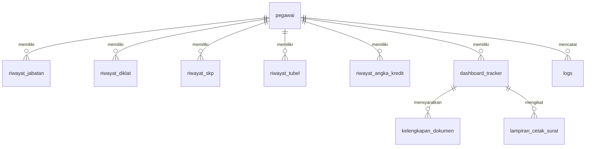
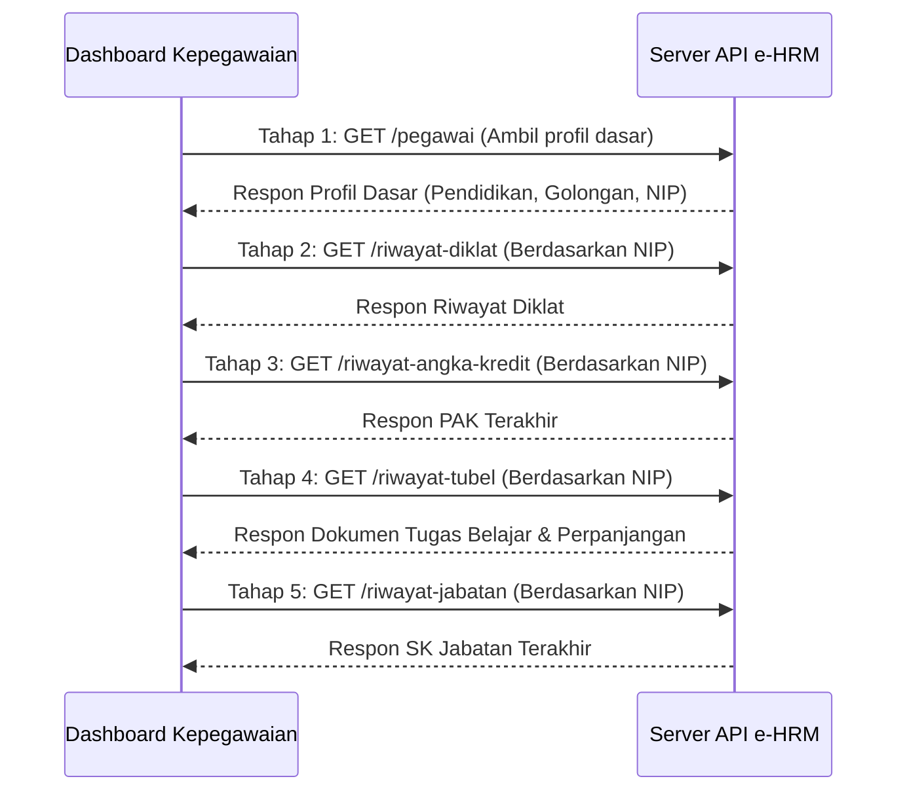

# Laporan Lengkap Proyek: Dashboard Kepegawaian & Notifikasi KGB
**JF PUSDATIN KEMENTERIAN PEKERJAAN UMUM DAN PERUMAHAN RAKYAT**

Laporan ini menyajikan rancangan arsitektur, skema database, integrasi API, pembagian kerja developer, serta petunjuk deployment dari **Sistem Dashboard Kepegawaian & Notifikasi Otomatis**. Dokumen ini disusun lengkap per bagian untuk dijadikan acuan resmi bagi masing-masing tim: **Database Administrator (DBA)**, **Tim Integrasi API**, **DevOps / QA**, serta **4 Pengembang Backend & Frontend**.

---

## 📌 1. Pendahuluan & Gambaran Umum

Sistem Dashboard Kepegawaian ini dirancang untuk memantau administrasi kepegawaian secara proaktif. Fokus utama sistem adalah melacak berbagai siklus kepegawaian seperti:
1.  **KGB (Kenaikan Gaji Berkala)**: Berulang setiap 2 tahun sekali.
2.  **KP (Kenaikan Pangkat)**: Struktural, Fungsional (Jafung), dan Reguler (Pelaksana).
3.  **KJ (Kenaikan Jenjang)**: Jabatan Fungsional.
4.  **UKOM (Uji Kompetensi)**: Persyaratan kenaikan jenjang.
5.  **TUBEL (Tugas Belajar)**: Pemantauan masa studi dan pengaktifan kembali PNS karyasiswa.

Mekanisme utama berjalan dengan menyinkronkan data profil & riwayat pegawai dari API e-HRM eksternal, melakukan pengolahan aturan kepegawaian (business rules), mendeteksi pencapaian target/milestone, dan mengirimkan notifikasi otomatis baik di dashboard admin maupun melalui email pegawai yang bersangkutan.

---

## 🗄️ 2. Bagian: Database & Skema Data (Untuk Tim DBA)

Sistem menggunakan database relasional (MySQL / MariaDB) dengan model relasi terpusat pada data pegawai.

### A. Diagram Hubungan Entitas (ERD - Mermaid Diagram)



---

### B. Kamus Data & Struktur Tabel Utama

#### 1. Tabel: `pegawai`
Menyimpan profil master pegawai hasil sinkronisasi dari API e-HRM.
*   **Primary Key**: `id_pegawai_api` (string/varchar)
*   **Kolom Penting**:
    *   `nip` (string, unique): Nomor Induk Pegawai.
    *   `nama` (string): Nama lengkap pegawai beserta gelar.
    *   `email` (string): Alamat email resmi pegawai untuk notifikasi.
    *   `pangkat_golongan` (string): Pangkat & golongan ruang saat ini (misal: "III/a", "III/b").
    *   `tmt_pangkat_terakhir` (date): Terhitung Mulai Tanggal pangkat terakhir.
    *   `tmt_kgb_terakhir` (date): Terhitung Mulai Tanggal KGB terakhir.
    *   `tipe_jabatan` (string): Jenis jabatan ("Fungsional", "Struktural", "Pelaksana", "Jabatan Lainnya").
    *   `jabatan_saat_ini` (string): Nama jabatan aktif saat ini.
    *   `jenjang` (string): Tingkatan jenjang jafung (misal: "Ahli Pertama", "Ahli Muda").
    *   `jenjang_pendidikan` (string): Pendidikan terakhir pegawai dari API e-HRM (misal: "S1", "D-III", "S2").
    *   `kd_eselon` (string): Kode eselon aktif (jika struktural).

#### 2. Tabel: `dashboard_tracker`
Menyimpan status pemantauan siklus kepegawaian aktif untuk setiap pegawai.
*   **Primary Key**: `id` (bigint, auto-increment)
*   **Foreign Key**: `pegawai_id` -> `pegawai.id_pegawai_api` (cascade on delete & update)
*   **Kolom Penting**:
    *   `kategori` (enum): Jenis pemantauan (`KGB`, `KP_Jafung`, `KP_Struktural`, `KP_Reguler`, `KJ_Jafung`, `UKOM`, `TUBEL`, `DIKLAT`).
    *   `tanggal_target` (date, nullable): Tanggal perkiraan jatuh tempo usulan.
    *   `status_saat_ini` (enum): Status progres usulan (`Aman`, `Mendekati`, `Usulan`, `Proses`, `Upload E-HRM`, `Menunggu UKOM`, `Menunggu SKP`, `Proses Pengaktifan Kembali`, `Selesai`, `Data Tidak Lengkap`).
    *   `keterangan` (text): Deskripsi detail status atau kekurangan berkas.
    *   `dokumen_total` (integer): Total berkas persyaratan yang wajib dipenuhi.
    *   `dokumen_terupload` (integer): Jumlah berkas persyaratan yang sudah diunggah oleh admin/pegawai.
    *   `notified_at` (timestamp, nullable): Tanggal terakhir email notifikasi dikirimkan ke pegawai.
    *   `dikonfirmasi_at` (timestamp, nullable): Waktu konfirmasi kelulusan/persetujuan oleh admin.

#### 3. Tabel: `kelengkapan_dokumen`
Melacak kelengkapan dokumen persyaratan manual untuk setiap tracker aktif.
*   **Primary Key**: `id` (bigint, auto-increment)
*   **Foreign Key**: `dashboard_tracker_id` -> `dashboard_tracker.id` (cascade on delete)
*   **Kolom Penting**:
    *   `nama_dokumen` (string): Nama dokumen persyaratan (misal: "SK Pangkat Terakhir", "SK PAK").
    *   `is_uploaded` (boolean): Menandakan apakah dokumen sudah lengkap / diunggah.
    *   `file_path` (string, nullable): Path lokasi penyimpanan berkas di server storage.

#### 4. Tabel Referensi / Kamus: `ref_matriks_jf`
Menyimpan matriks referensi angka kredit dan batas jabatan untuk kenaikan pangkat / jenjang fungsional.
*   **Primary Key**: `id` (integer, auto-increment)
*   **Kolom Penting**:
    *   `jabatan_asal` / `next_jabatan` (string)
    *   `pangkat_asal` / `next_pangkat` (string)
    *   `target_ak` (double): Target angka kredit kumulatif minimal.
    *   `koefisien_tahunan` (double): Koefisien perolehan AK tahunan standar.
    *   `is_naik_jenjang` (boolean): Menandakan apakah baris ini memicu perpindahan jenjang jabatan (misal: Ahli Pertama ke Ahli Muda).

---

## 🔗 3. Bagian: Integrasi API e-HRM (Untuk Tim Integrasi)

Proses sinkronisasi data ditarik secara periodik dari API Pusat e-HRM melalui kelas CLI Command.

### A. Alur Sinkronisasi 5 Tahap (Sequential Stage Sync)



### B. Pemetaan Field JSON API ke Database Lokal

| Field JSON dari API e-HRM | Kolom Database Tujuan (`pegawai`) | Keterangan / Konversi |
|---------------------------|----------------------------------|-----------------------|
| `nip`                     | `nip`                            | Unik                  |
| `nama_lengkap`            | `nama`                           | String                |
| `email_dinas`             | `email`                          | Email tujuan notif    |
| `golongan_ruang`          | `pangkat_golongan`               | String (III/a, dst.)  |
| `pendidikan`              | `jenjang_pendidikan`             | String (S1, D3, dll)  |
| `tmt_pangkat`             | `tmt_pangkat_terakhir`           | Di-cast ke Date       |
| `tmt_kgb`                 | `tmt_kgb_terakhir`               | Di-cast ke Date       |
| `eselon_id`               | `kd_eselon`                      | Mapping kode eselon   |

---

## 💻🎨 4. Pembagian Kerja Pengembang: Backend & Frontend (Untuk 4 Developer)

Seluruh logika backend dan antarmuka frontend dibagi menjadi 4 job deskripsi spesifik agar pengerjaan dapat berjalan paralel tanpa terjadi konflik kode.

```mermaid
grid-layout
    columns 2
    row-gap 20
    col-gap 20
    
    dev1["DEVELOPER 1 (Backend)<br/><b>Core Sync & Tracker Engine</b><br/>(API e-HRM, Cron Jobs, KGB, TUBEL)"]
    dev2["DEVELOPER 2 (Backend)<br/><b>Logika Bisnis & Dokumen</b><br/>(KP, KJ, UKOM, DomPDF, FPDI)"]
    dev3["DEVELOPER 3 (Frontend)<br/><b>Arsitektur CSS & UI Layout</b><br/>(Tailwind v4, CSS Grid, Accordion)"]
    dev4["DEVELOPER 4 (Frontend)<br/><b>Client Logic & Interaktivitas</b><br/>(Driver.js, Modals, Bypass Cache, SweetAlert2)"]
```

### 🧑‍💻 DEVELOPER 1: Core Sync & Tracker Engine (API Integration, Cron Jobs, KGB & TUBEL)
*   **Fokus Utama**: Mengelola penarikan data dari API e-HRM, penjadwalan latar belakang (*background processes / cron jobs*), serta mesin pelacak otomatis untuk siklus KGB dan Tugas Belajar (TUBEL).
*   **Modul & Berkas yang Dikelola**:
    1.  **[SyncEhrmData.php](file:///c:/laragon/www/dashboard-kepegawaian/app/Console/Commands/SyncEhrmData.php)** (Console Command): Mengatur alur integrasi API e-HRM 5 tahap.
    2.  **[RecalculateTracker.php](file:///c:/laragon/www/dashboard-kepegawaian/app/Console/Commands/RecalculateTracker.php)** (Console Command): Menjalankan pemrosesan otomatis seluruh data tracker.
    3.  **[SendPeriodicNotifications.php](file:///c:/laragon/www/dashboard-kepegawaian/app/Console/Commands/SendPeriodicNotifications.php)** (Console Command): Mengirim rangkuman usulan ke Admin setiap Senin pagi.
    4.  **[KgbTrackerService.php](file:///c:/laragon/www/dashboard-kepegawaian/app/Services/Tracker/KgbTrackerService.php)** (Service): Menangani logika KGB (+2 tahun dari KGB terakhir).
    5.  **[TubelService.php](file:///c:/laragon/www/dashboard-kepegawaian/app/Services/Tracker/TubelService.php)** (Service): Menangani pelacakan masa studi Tugas Belajar dan usulan pengaktifan kembali (H-60 hari selesai studi).
*   **Tanggung Jawab Teknis**:
    *   Memastikan data pegawai, diklat, angka kredit, tugas belajar, dan jabatan tersinkronisasi tanpa *timeout* melalui koneksi API.
    *   Memetakan dokumen fisik otomatis dari API e-HRM (misal: memetakan `arsip_izin_belajar` langsung menjadi `is_uploaded = true` di sistem lokal).
    *   Menghindari ter-resetnya status Tugas Belajar pegawai yang sudah dikonfirmasi "Selesai" oleh admin pada kalkulasi berikutnya.
    *   Mengonfigurasi penjadwalan berkala (*Laravel Task Scheduler*) agar sinkronisasi data berjalan setiap malam.

---

### 🧑‍💻 DEVELOPER 2: Logika Bisnis & Dokumen Generator (Kenaikan Pangkat, Kenaikan Jenjang, UKOM & PDF)
*   **Fokus Utama**: Mengelola seluruh logika aturan kepegawaian (*business rules*) untuk Kenaikan Pangkat (KP), Kenaikan Jenjang (KJ), Uji Kompetensi (UKOM), serta mesin pembuatan dokumen otomatis (PDF generator & PDF merger).
*   **Modul & Berkas yang Dikelola**:
    1.  **[KenaikanPangkatService.php](file:///c:/laragon/www/dashboard-kepegawaian/app/Services/Tracker/KenaikanPangkatService.php)** (Service): Mengelola aturan kenaikan pangkat fungsional, struktural, dan reguler.
    2.  **[KenaikanJenjangService.php](file:///c:/laragon/www/dashboard-kepegawaian/app/Services/Tracker/KenaikanJenjangService.php)** (Service): Mengelola aturan kenaikan jenjang jabatan fungsional.
    3.  **[SuratPengajuanController.php](file:///c:/laragon/www/dashboard-kepegawaian/app/Http/Controllers/SuratPengajuanController.php)** (Controller): Menggenerate file PDF Nota Dinas usulan otomatis dan menyatukan dokumen lampiran fisik.
    4.  **[DashboardController.php](file:///c:/laragon/www/dashboard-kepegawaian/app/Http/Controllers/DashboardController.php)** (Controller): Mengatur penyediaan data statistik dashboard dan aksi ukom/checklist konfirmasi.
*   **Tanggung Jawab Teknis**:
    *   Mengimplementasikan aturan *ceiling pangkat* (batas golongan berdasarkan ijazah terakhir) untuk KP Reguler (Pelaksana), serta otomatis menghapus tracker jika pangkat pegawai telah mentok.
    *   Mengecek kepatuhan nilai SKP tahunan (2 tahun terakhir harus bernilai BAIK atau SANGAT BAIK) sebagai syarat mutlak KP.
    *   Mencocokkan pencapaian Angka Kredit (AK) pegawai dengan tabel referensi **[RefMatriksJf](file:///c:/laragon/www/dashboard-kepegawaian/app/Models/RefMatriksJf.php)**.
    *   Membuat sistem cetak otomatis dokumen Nota Dinas (menggunakan DomPDF) sesuai format resmi Pusdatin PUPR, serta menggabungkan lampiran PDF pendukung (menggunakan FPDI).

---

### 🧑‍💻 DEVELOPER 3: Arsitektur CSS & Tata Letak UI Utama (Layout, Tables, Dashboard Accordion, & Responsive Design)
*   **Fokus Utama**: Mengembangkan arsitektur styling utama sistem (Tailwind CSS v4 + Custom CSS), merancang struktur tata letak (grid & flexbox), serta mendesain tabel data dan accordion status di dashboard.
*   **Modul & Berkas yang Dikelola**:
    1.  **[app.css](file:///c:/laragon/www/dashboard-kepegawaian/resources/css/app.css)** (Stylesheet): Entry point modular CSS utama.
    2.  **[layout.css](file:///c:/laragon/www/dashboard-kepegawaian/resources/css/layout.css)** (Stylesheet): Menangani grid sistem, sidebar, navbar, dan responsive wrapper.
    3.  **[components.css](file:///c:/laragon/www/dashboard-kepegawaian/resources/css/components.css)** (Stylesheet): Mengelola style untuk kartu statistik, tabel, form, badge status, dan accordion tracker.
    4.  **[app.blade.php](file:///c:/laragon/www/dashboard-kepegawaian/resources/views/layouts/app.blade.php)** (Blade Master Layout): Menyediakan kerangka dasar halaman.
    5.  `resources/views/dashboard/index.blade.php` (Blade View): Mengatur tata letak visual utama dashboard admin (statistik dan baris usulan).
    6.  `resources/views/data_pegawai/` (Blade Views): Menyusun tampilan tabel daftar pegawai beserta kontrol filter dan kolom pencarian.
*   **Tanggung Jawab Teknis**:
    *   Memastikan dashboard responsif dan nyaman digunakan di berbagai ukuran layar (desktop maupun tablet/ponsel).
    *   Merancang styling accordion tracker agar teratur dan rapi saat dibuka/ditutup oleh admin.
    *   Menerapkan visualisasi tingkat kepatuhan unggah berkas berupa diagram persentase atau *progress bar* yang dinamis.
    *   Mengintegrasikan Tailwind CSS v4 dengan font khusus (*Instrument Sans / Inter*) dan ikon visual.

---

### 🧑‍💻 DEVELOPER 4: Client-Side Logic & Interaktivitas UI (Interactions, Modals, Bypass Cache, & Driver.js)
*   **Fokus Utama**: Menangani interaktivitas JavaScript di browser, alur kerja modal pop-up, manajemen template konfigurasi pesan, serta integrasi library interaktif (seperti Driver.js untuk tur pemandu, SweetAlert2, dll.).
*   **Modul & Berkas yang Dikelola**:
    1.  `public/js/app-common.js` (JavaScript): Berisi logika client-side penanganan preview PDF, pemuatan ulang modal, dan manipulasi DOM.
    2.  `resources/views/partials/` (Blade Partials): Mengelola modals seperti modal cetak surat (`modal_surat.blade.php`), modal ganti password, modal konfirmasi, dan overlay loading sync.
    3.  `resources/views/konfigurasi_pesan/` (Blade Views): Halaman pengelolaan template notifikasi pesan email.
    4.  `resources/views/log_aktivitas/` (Blade Views): Antarmuka riwayat log dengan integrasi ekspor file PDF.
*   **Tanggung Jawab Teknis**:
    *   Mengatasi masalah pratinjau PDF di iframe browser yang kerap menampilkan file lama (stale cache) dengan menulis skrip bypass cache (kloning iframe + append timestamp query string).
    *   Memperbaiki bug parameter pada tombol aksi konfirmasi agar modal secara akurat menampilkan Nama Pegawai (bukan ID atau NIP saja) sebelum disetujui.
    *   Mengatur modal langkah-demi-langkah (multi-step wizard) untuk proses cetak surat pengajuan dan pengelolaan lampiran.
    *   Mengintegrasikan panduan tur interaktif menggunakan library **Driver.js** guna membimbing admin baru dalam mengoperasikan dashboard kepegawaian.

---

## 🚀 5. Bagian: Panduan Instalasi & Deployment (Untuk Tim DevOps / QA)

### A. Persyaratan Sistem
*   **Web Server**: Apache / Nginx
*   **PHP Version**: `>= 8.2` (dengan ekstensi `pdo_mysql`, `openssl`, `mbstring`, `xml`, `curl`, `zip`)
*   **Database**: MySQL `>= 8.0` / MariaDB `>= 10.4`
*   **Package Managers**: Composer (PHP) dan Node.js `>= 18` + NPM (Frontend)

### B. Konfigurasi Environment File (`.env`)

```ini
# Konfigurasi Aplikasi dasar
APP_NAME="Dashboard Kepegawaian Pusdatin"
APP_ENV=production
APP_KEY=base64:xxx...
APP_DEBUG=false
APP_URL=http://dashboard-kepegawaian.pu.go.id

# Konfigurasi Database
DB_CONNECTION=mysql
DB_HOST=127.0.0.1
DB_PORT=3306
DB_DATABASE=db_kepegawaian
DB_USERNAME=root
DB_PASSWORD=rahasia

# Pengaturan Antrean (Queue)
QUEUE_CONNECTION=sync

# Konfigurasi Mail Server (SMTP)
MAIL_MAILER=smtp
MAIL_HOST=smtp.gmail.com
MAIL_PORT=587
MAIL_USERNAME=admin.kepegawaian@pu.go.id
MAIL_PASSWORD="app_password_google"
MAIL_ENCRYPTION=tls
MAIL_FROM_ADDRESS=admin.kepegawaian@pu.go.id
MAIL_FROM_NAME="Admin Kepegawaian Pusdatin"

# Konfigurasi API Endpoint e-HRM
EHRM_API_URL=https://ehrm.pu.go.id/api/v1
EHRM_API_KEY=api_key_rahasia_anda
```

---

### C. Langkah-Langkah Deployment Baru (Fresh Install)

Jalankan perintah ini secara berurutan pada root direktori proyek:

```bash
# 1. Clone repositori & masuk ke direktori proyek
git clone https://github.com/pusdatin-pu/dashboard-kepegawaian.git
cd dashboard-kepegawaian

# 2. Salin berkas konfigurasi lingkungan
cp .env.example .env

# 3. Instal dependensi PHP (Production Mode)
composer install --no-dev --optimize-autoloader

# 4. Generate Application Key
php artisan key:generate

# 5. Jalankan migrasi database beserta data master awal (Seeders)
php artisan migrate --force
php artisan db:seed --class=DatabaseSeeder --force

# 6. Instal dependensi Javascript & lakukan kompilasi aset frontend
npm install
npm run build

# 7. Atur perizinan folder storage & bootstrap cache (Penting untuk Linux Server)
chmod -R 775 storage bootstrap/cache
chown -R www-data:www-data storage bootstrap/cache
```

---

### D. Perawatan Berkala (Maintenance) & Sinkronisasi Rutin

Agar sistem dapat memperbarui status secara otomatis setiap hari, konfigurasikan scheduler pada sistem operasi Linux (Cron Job). Tambahkan entri berikut pada `crontab -e` user server:

```cron
# Menjalankan pemrosesan scheduler Laravel setiap menit
* * * * * cd /var/www/dashboard-kepegawaian && php artisan schedule:run >> /dev/null 2>&1
```

Di dalam `app/Console/Kernel.php`, scheduler telah dikonfigurasi untuk menjalankan tugas berikut secara otomatis:
*   `ehrm:sync` -> Dijalankan setiap hari pukul 01:00 WIB (karena mengambil data banyak via API).
*   `tracker:run` -> Dijalankan setiap hari pukul 03:00 WIB (melakukan kalkulasi ulang status kepegawaian).
*   `notifications:send-periodic` -> Dijalankan setiap hari Senin pukul 08:00 WIB (mengirim email rangkuman ke admin).
