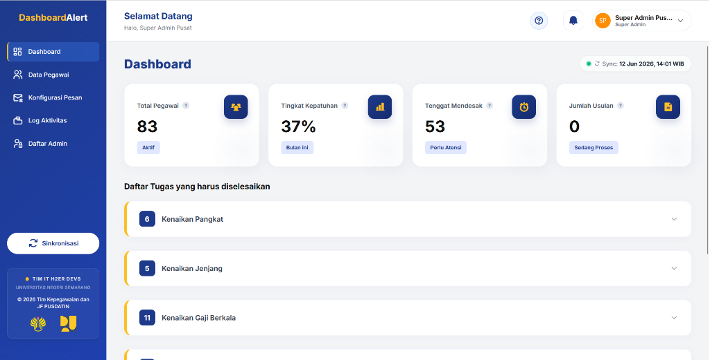

<div align="center">

# 🏢 Dashboard Kepegawaian & Notifikasi Pusdatin
### Sistem Manajemen & Pemantauan Karier Digital — Pusat Data dan Teknologi Informasi, Sekretariat Jenderal, Kementerian Pekerjaan Umum

<a href="https://laravel.com"></a> <a href="https://php.net"></a> <a href="https://tailwindcss.com"></a> <a href="https://www.docker.com"></a> <a href="https://spbe.go.id"></a>

</div>

-----

## 📋 Daftar Isi
*   [Tentang Proyek](#-tentang-proyek)
*   [Fitur Utama](#-fitur-utama)
*   [Tech Stack](#-tech-stack)
*   [Arsitektur Sistem](#-arsitektur-sistem)
*   [Prasyarat](#-prasyarat)
*   [Instalasi & Setup](#-instalasi--setup)
*   [Menjalankan Aplikasi](#%EF%B8%8F-menjalankan-aplikasi)
*   [Struktur Proyek](#-struktur-proyek)
*   [Alur Bisnis & State Machine](#-alur-bisnis--state-machine)
*   [Skema Database Lengkap](#-skema-database-lengkap)
*   [API & Rute Web Lengkap](#-api--rute-web-lengkap)
*   [Generate Dokumen & Notifikasi](#-generate-dokumen--notifikasi)
*   [Kebijakan Keamanan & Hardening (VAPT)](#-kebijakan-keamanan--hardening-vapt)
*   [Deployment dengan Docker](#-deployment-dengan-docker)
*   [Screenshot](#-screenshot)
*   [Kontributor](#-kontributor)
*   [Lisensi](#-lisensi)

---

## 🏢 Tentang Proyek
**Dashboard Kepegawaian & Notifikasi Pusdatin** adalah sistem informasi internal kementerian yang dirancang untuk mengotomatisasi pemantauan siklus karier kepegawaian di Pusat Data dan Teknologi Informasi, Kementerian Pekerjaan Umum. Sistem ini mencakup pemantauan kelayakan **Kenaikan Gaji Berkala (KGB)**, **Kenaikan Pangkat (KP)**, **Kenaikan Jenjang (KJ)**, **Tugas Belajar (Tubel)**, dan pemenuhan jam **Diklat**.

Sistem ini menggantikan pemantauan manual berbasis spreadsheet menjadi alur kerja digital terpadu yang selaras dengan **Sistem Pemerintahan Berbasis Elektronik (SPBE)** (Perpres No. 95/2018), meliputi:
*   **Integrasi e-HRM API**: Koneksi langsung ke master API Gateway e-HRM Kementerian PU (bukan sistem silo data).
*   **Deteksi Kelayakan Otomatis**: Logika berkala memantau TMT pangkat, TMT KGB, nilai SKP 2 tahun terakhir, dan pemenuhan Angka Kredit (PAK).
*   **Hardening Keamanan**: Menonaktifkan mode debug (`APP_DEBUG=false`), proteksi bawaan terhadap SQLi dan XSS, pembatasan rate limiting pada rute sensitif, serta kebijakan perubahan kata sandi wajib bagi akun administrator baru.

---

## ✨ Fitur Utama

### 🌐 Sisi Pegawai & Notifikasi Otomatis
| Fitur | Deskripsi |
| :--- | :--- |
| **Notifikasi Email KGB** | Pengiriman surat pemberitahuan KGB HTML resmi otomatis ke inbox pegawai (H-0 bulan). |
| **Pemberitahuan Diklat/Tubel** | Email pengingat otomatis bagi pegawai yang mendekati batas waktu unggah sertifikat diklat atau izin belajar. |
| **Pengingat Manual Sekali Klik** | Memungkinkan admin mengirim ulang email pengingat instan langsung dari panel detail pegawai. |

### 🔐 Sisi Admin (Dashboard & Manajemen)
| Fitur | Deskripsi |
| :--- | :--- |
| **Dashboard Utama** | Menampilkan KPI Cards (Jumlah Pegawai, Usulan KGB aktif, Usulan KP, Diklat berjalan), dan grafik pemantauan real-time. |
| **Manajemen Pegawai** | Master data pegawai lengkap dengan tabs informasi karier, audit log personal, riwayat Angka Kredit, dan unggahan file dokumen wajib. |
| **Audit Log (Activity)** | Riwayat seluruh aktivitas yang dilakukan oleh admin atau trigger otomatis dari sistem untuk transparansi operasional. |
| **Pusat Konfigurasi** | Pengaturan template pesan pengingat dinamis berbasis placeholder (seperti `{nama}`, `{deadline}`, `{ak_sekarang}`). |
| **Database Backup** | Fitur backup database sekali-klik yang langsung mengunduh arsip `.sql` database untuk keamanan data. |

---

## 🛠 Tech Stack

| Layer | Teknologi |
| :--- | :--- |
| **Backend** | PHP 8.2 / 8.3, Laravel 11 |
| **Frontend** | Blade Templates, Tailwind CSS 4, Driver.js (Interactive Tour), TomSelect |
| **Database** | MySQL 8.0 / MariaDB |
| **Caching & Queue** | Redis (Optional) / Database Driver untuk antrean notifikasi |
| **PDF & Export** | DomPDF, PhpSpreadsheet (Import & Export Excel) |
| **Containerization** | Docker & Docker Compose |

---

## 🏗 Arsitektur Sistem

```text
┌─────────────────────────────────────────────────────────┐
│                    BROWSER (Client)                      │
├──────────────────┬──────────────────────────────────────┤
│  User Dashboard  │           Admin Panel                │
│  & Notifications │  (Auth & Password Force Change)      │
├──────────────────┴──────────────────────────────────────┤
│                                                          │
│               Laravel 11 (PHP 8.2/8.3)                   │
│  ┌──────────┐ ┌──────────┐ ┌───────────┐ ┌───────────┐  │
│  │Controller│ │  Models  │ │   Mail    │ │ Middleware│  │
│  │  (11x)   │ │  (13x)   │ │  (SMTP)   │ │ (Auth/Pwd)│  │
│  │          │ │          │ │           │ │           │  │
│  └──────────┘ └──────────┘ └───────────┘ └───────────┘  │
│       │              │           │           │          │
│  ┌────▼──────────────▼───────────▼───────────▼──────┐   │
│  │                  MySQL Database                   │   │
│  │  ┌─────────────┐ ┌──────────┐ ┌───────────────┐  │   │
│  │  │   pegawai   │ │ tracker  │ │   logs_audit  │  │   │
│  │  └─────────────┘ └──────────┘ └───────────────┘  │   │
│  └──────────────────────────────────────────────────┘   │
│       ▲                                                  │
│  ┌────┴──────────────────────────────────────────────┐  │
│  │          e-HRM API GATEWAY (KemenPU)              │  │
│  │  - Master Data Pegawai   - Riwayat Jabatan/SKP    │  │
│  └───────────────────────────────────────────────────┘  │
└─────────────────────────────────────────────────────────┘
```

---

## 📦 Prasyarat

### Lokal (Laragon / XAMPP)
*   PHP >= 8.2
*   Composer >= 2.x
*   Node.js >= 18.x + NPM
*   MySQL >= 8.0
*   Git

### Docker (Rekomendasi Produksi)
*   Docker Desktop >= 20.x
*   Docker Compose >= 2.x

---

## 🚀 Instalasi & Setup

### Opsi 1: Setup Lokal (Manual)
1.  **Clone repository:**
    ```bash
    git clone https://github.com/username/dashboard-kepegawaian.git
    cd dashboard-kepegawaian
    ```
2.  **Install dependencies PHP & Node:**
    ```bash
    composer install
    npm install && npm run build
    ```
3.  **Setup environment (.env):**
    ```bash
    cp .env.example .env
    php artisan key:generate
    ```
4.  **Konfigurasi parameter pada file `.env`:**
    ```ini
    # Mode Debug (Set false untuk lingkungan produksi)
    APP_DEBUG=false
    
    # Koneksi Database MySQL (Ganti DB_HOST menjadi 'db' jika menggunakan Docker)
    DB_CONNECTION=mysql
    DB_HOST=127.0.0.1
    DB_PORT=3306
    DB_DATABASE=db_kepegawaian
    DB_USERNAME=root
    DB_PASSWORD=secret
    
    # Konfigurasi Koneksi API e-HRM Pusat
    EHRM_BASE_URL="https://apigw.pu.go.id"
    EHRM_API_KEY="your-api-gateway-key"
    EHRM_USER_EMAIL="your-user-email@pu.go.id"
    EHRM_USER_PASS="your-api-password"
    EHRM_NEW_TOKEN="your-jwt-modules-token"
    ```
5.  **Jalankan migrasi database & database seeding:**
    ```bash
    php artisan migrate:fresh --seed
    ```
6.  **Buat tautan storage:**
    ```bash
    php artisan storage:link
    ```

### Opsi 2: Docker Setup (Lihat di bagian Deployment dengan Docker)

---

## ⚙️ Konfigurasi Email (SMTP)
Untuk mengaktifkan pengiriman email notifikasi KGB secara otomatis ke pegawai, atur konfigurasi SMTP berikut di file `.env` (Menggunakan SMTP Office 365 Resmi KemenPU):

```ini
MAIL_MAILER=smtp
MAIL_HOST=smtp.office365.com
MAIL_PORT=587
MAIL_USERNAME=your-email@pu.go.id
MAIL_PASSWORD="your-email-password"
MAIL_ENCRYPTION=tls
MAIL_FROM_ADDRESS="your-email@pu.go.id"
MAIL_FROM_NAME="Kepegawaian Pusdatin"
```

---

## ▶️ Menjalankan Aplikasi

### Development Server Lokal
Untuk menjalankan server Laravel, proses antrean email, dan kompilasi front-end secara bersamaan:

```bash
# Jalankan server lokal Laravel
php artisan serve

# Terminal 2: Jalankan kompilasi CSS & JS Vite
npm run dev

# Terminal 3: Jalankan queue worker (wajib untuk pengiriman email)
php artisan queue:listen
```

Akses aplikasi di browser: **`http://localhost:8000`**

---

## 📂 Struktur Proyek

```text
dashboard-kepegawaian/
├── app/
│   ├── Console/
│   │   └── Commands/
│   │       ├── RecalculateTracker.php       # Perintah cronjob re-kalkulasi status tracker
│   │       └── SyncEhrmData.php             # Perintah cronjob sync data dari API e-HRM
│   ├── Http/
│   │   └── Controllers/
│   │       ├── AuthController.php           # Autentikasi Login & Logout Admin
│   │       ├── DashboardController.php      # Main dashboard stats & sinkronisasi manual
│   │       ├── DataPegawaiController.php    # Detail modal pegawai & kelengkapan berkas
│   │       ├── KonfigurasiPesanController.php # Pengaturan template notifikasi (Rules)
│   │       ├── LogAktivitasController.php   # Audit trail aktivitas admin & sistem
│   │       └── DatabaseBackupController.php # Manajemen backup basis data manual
│   ├── Models/
│   │   ├── Pegawai.php                     # Master data pegawai kementerian
│   │   ├── DashboardTracker.php            # Data status pelacak karir (KGB, KP, KJ, dll)
│   │   ├── RiwayatAngkaKredit.php          # Histori PAK (Penilaian Angka Kredit)
│   │   ├── KelengkapanDokumen.php          # Status verifikasi berkas per pegawai
│   │   └── Logs.php                        # Logging riwayat audit sistem
│   └── Services/
│       └── Tracker/                        # Kumpulan logika evaluasi karir
│           ├── TrackerInterface.php        # Interface standarisasi tracker
│           ├── KgbTrackerService.php       # Logika kelayakan KGB (Gaji Berkala)
│           ├── KenaikanPangkatService.php  # Logika kelayakan KP (Kenaikan Pangkat)
│           ├── KenaikanJenjangService.php  # Logika kelayakan KJ (Kenaikan Jenjang)
│           ├── TubelService.php            # Logika kelayakan Tugas Belajar (Tubel)
│           ├── DiklatService.php           # Logika kelayakan Jam Diklat Pegawai
│           └── UkomService.php             # Logika kelayakan Uji Kompetensi (Ukom)
├── database/
│   ├── migrations/                         # Skema tabel database (pegawai, logs, dll)
│   └── seeders/                            # Seeder data master, admin, & aturan notifikasi
├── public/
│   └── js/
│       ├── data-pegawai.js                 # Logika interaktivitas detail modal & tab switcher
│       └── dashboard-ui.js                 # Integrasi tour Driver.js & chart dashboard
├── resources/
│   └── views/
│       ├── auth/                           # Halaman login administrator
│       ├── dashboard/                      # Halaman utama statistik & status ringkasan
│       ├── data_pegawai/                   # Halaman list & detail data pegawai
│       ├── konfigurasi_pesan/              # Halaman konfigurasi template pengingat
│       ├── log_aktivitas/                  # Halaman log audit trail aktivitas
│       ├── emails/                         # Template email notifikasi resmi kementerian
│       └── layouts/                        # Kerangka utama tampilan (sidebar, navbar)
├── routes/
│   └── web.php                             # Semua rute URL & middleware web
├── Dockerfile                              # Resep pembuatan container docker aplikasi
└── docker-compose.yml                      # Orkestrasi Docker container & database
```

---

## 🔄 Alur Bisnis & State Machine

Setiap pegawai yang terdaftar akan dilewatkan ke mesin pengevaluasi (*Evaluator Tracker Engine*) secara berkala. Berikut status transisi pelacak kepegawaian:

```text
[Aman] ──(H-2 Bulan)──> [Mendekati] ──(H-0 Bulan)──> [Usulan] ──(Admin ACC)──> [Proses] ──(Unggah SK)──> [Selesai]
```

### 1. KGB State Cycle
*   **Aman**: TMT KGB berikutnya berjarak > 2 bulan dari hari ini.
*   **Mendekati**: TMT KGB berikutnya berjarak <= 2 bulan. Status ini men-trigger alarm di Dashboard Admin.
*   **Usulan**: Memasuki bulan TMT. Sistem otomatis mengirimkan email Kop Surat Resmi ke pegawai bersangkutan untuk melengkapi berkas, dan memindahkan status ke **Proses**.
*   **Selesai**: Admin mengunggah SK KGB baru yang ditandatangani. Sistem memperbarui data TMT ke siklus 2 tahun berikutnya dan status kembali ke **Aman**.

### 2. Kenaikan Pangkat (KP Jafung) State Cycle
*   Sistem membandingkan angka kredit kumulatif pegawai saat ini dengan `RefMatriksJf`.
*   Jika **Angka Kredit Cukup** dan **Nilai SKP 2 tahun berpredikat minimal BAIK**, status berpindah ke **Usulan**.
*   Admin memverifikasi berkas fisik. Setelah berkas lengkap dan disetujui, admin mengklik **Konfirmasi**. Status berubah menjadi **Selesai** setelah nomor SK pangkat baru diterbitkan dan diinput.

---

## 🗄 Skema Database Lengkap

Berikut adalah skema tabel utama dan relasinya di dalam database `db_kepegawaian`:

### 1. Tabel `pegawai` (Master Data Pegawai)
| Kolom | Tipe | Deskripsi |
| :--- | :--- | :--- |
| `id` | BIGINT (PK) | Primary Key unik |
| `nip` | VARCHAR (18) | Nomor Induk Pegawai (Unique) |
| `nama` | VARCHAR (255) | Nama lengkap pegawai beserta gelar |
| `email` | VARCHAR (255) | Email instansi / pribadi |
| `no_hp` | VARCHAR (20) | Nomor telepon/WhatsApp aktif |
| `pangkat_golongan` | VARCHAR (10) | Pangkat/Golongan terakhir (misal: III/c) |
| `jabatan_saat_ini` | VARCHAR (255) | Nama jabatan fungsional atau struktural |
| `tipe_jabatan` | VARCHAR (100) | Kategori jabatan (Fungsional / Struktural / Pelaksana) |
| `jenjang` | VARCHAR (100) | Jenjang fungsional (Ahli Pertama / Ahli Muda / Ahli Madya) |
| `tmt_cpns` | DATE | Tanggal Mulai Tugas CPNS |
| `tmt_kgb_terakhir` | DATE | Tanggal Mulai Tugas KGB terakhir |
| `tmt_pangkat_terakhir`| DATE | Tanggal Mulai Tugas Pangkat terakhir |
| `sk_pangkat_terakhir` | VARCHAR (255) | Path berkas PDF SK Pangkat terakhir |
| `arsip_skp_2_tahun` | JSON | Penyimpanan array file SKP tahun N-1 dan N-2 |

### 2. Tabel `dashboard_tracker` (Transaksi Pelacak Karir)
| Kolom | Tipe | Deskripsi |
| :--- | :--- | :--- |
| `id` | BIGINT (PK) | Primary Key unik |
| `id_pegawai_api` | INT | Foreign Key merujuk ke database master e-HRM |
| `kategori` | ENUM | Jenis proses: `KGB`, `KP_Jafung`, `KJ_Jafung`, `KP_Reguler`, `KP_Struktural`, `TUBEL`, `DIKLAT` |
| `status_saat_ini` | VARCHAR (50) | Status: `Aman`, `Mendekati`, `Usulan`, `Proses`, `Menunggu UKOM`, `Selesai`, `Anulir` |
| `tmt_proses` | DATE | Estimasi tanggal realisasi kenaikan pangkat/KGB |
| `dikonfirmasi_at` | TIMESTAMP | Tanggal konfirmasi persetujuan admin |
| `keterangan` | TEXT | Catatan khusus dari admin atau sistem |

### 3. Tabel `riwayat_angka_kredit` (Histori Penilaian Angka Kredit)
| Kolom | Tipe | Deskripsi |
| :--- | :--- | :--- |
| `id` | BIGINT (PK) | Primary Key unik |
| `id_pegawai_api` | INT | Foreign Key pegawai |
| `nomor_sk` | VARCHAR (255) | Nomor SK PAK resmi |
| `tanggal_sk` | DATE | Tanggal penandatanganan SK |
| `tmt_angka_kredit` | DATE | Tanggal Mulai Berlaku PAK |
| `total_kredit` | DOUBLE | Nilai total Angka Kredit kumulatif |
| `kredit_utama` | DOUBLE | Nilai Angka Kredit unsur utama |
| `kredit_penunjang` | DOUBLE | Nilai Angka Kredit unsur penunjang |
| `jabatan_saat_penilaian`| VARCHAR(255)| Jabatan saat PAK diterbitkan (fallback jika kosong) |

### 4. Tabel `kelengkapan_dokumen` (Verifikasi Berkas)
| Kolom | Tipe | Deskripsi |
| :--- | :--- | :--- |
| `id` | BIGINT (PK) | Primary Key |
| `id_tracker` | BIGINT (FK) | Merujuk ke `dashboard_tracker` |
| `nama_dokumen` | VARCHAR (255) | Nama berkas wajib (misal: "SKP 2 Tahun", "SK Pangkat") |
| `is_uploaded` | BOOLEAN | Status keberadaan file |
| `path_file` | VARCHAR (255) | Lokasi penyimpanan dokumen PDF di storage server |

### 5. Tabel `logs` (Audit Trail)
| Kolom | Tipe | Deskripsi |
| :--- | :--- | :--- |
| `id` | BIGINT (PK) | Primary Key |
| `id_admin` | INT (FK) | Akun admin pengeksekusi (NULL jika sistem/cron) |
| `tipe` | VARCHAR (50) | Jenis tindakan: `LOGIN`, `LOGOUT`, `SYNC_EHRM`, `UPDATE_PEGAWAI`, `SYSTEM_LOG` |
| `deskripsi` | TEXT | Pesan aktivitas detail |
| `waktu` | TIMESTAMP | Waktu eksekusi aktivitas |

---

## 🌐 API & Rute Web Lengkap

Berikut adalah tabel rute pemetaan web yang terdaftar pada sistem (dilindungi middleware otentikasi):

### 🔐 Rute Publik & Tamu (Guest Routes)
| Method | URI | Nama Rute | Deskripsi |
| :--- | :--- | :--- | :--- |
| `GET` | `/` | - | Pengalihan otomatis (redirect) ke halaman login |
| `GET` | `/login` | `login` | Menampilkan antarmuka login admin |
| `POST` | `/login` | - | Verifikasi kredensial akun administrator |
| `GET` | `/forgot-password` | `password.request` | Form permintaan link reset password |
| `POST` | `/forgot-password`| `password.email` | Mengirim tautan token reset password ke email |
| `GET` | `/validate-reset-link/{token}` | `password.validate` | Verifikasi validitas token reset |
| `GET` | `/reset-password` | `password.reset` | Form input password baru |
| `POST` | `/reset-password` | `password.update` | Memperbarui password di database |

### 🏢 Rute Terotentikasi (Auth Required - Admin Panel)
| Method | URI | Nama Rute | Deskripsi |
| :--- | :--- | :--- | :--- |
| `POST` | `/logout` | `logout` | Keluar dari sesi administrator |
| `POST` | `/change-password` | `change-password.update`| Ubah password admin secara mandiri |
| `GET` | `/backup-database` | `database.backup` | Backup data & unduh file `.sql` database |
| `GET` | `/force-change-password`| `password.force-change`| Tampilan paksa ganti password bagi akun baru |
| `POST` | `/force-change-password`| `password.force-change.update`| Proses update password wajib |

### 📊 Rute Pengelolaan & Monitoring Utama
| Method | URI | Nama Rute | Deskripsi |
| :--- | :--- | :--- | :--- |
| `GET` | `/dashboard` | `dashboard` | Tampilan dashboard statistik & KPI utama |
| `POST` | `/tracker/{id}/confirm` | `tracker.confirm` | Konfirmasi kelayakan berkas pegawai oleh admin |
| `POST` | `/tracker/{id}/move-to-ukom`| `tracker.move-to-ukom` | Mendaftarkan pegawai ke modul UKOM (KJ) |
| `POST` | `/tracker/{id}/set-kelulusan-ukom`| `tracker.set-kelulusan-ukom` | Menyimpan status kelulusan ujian UKOM |
| `POST` | `/sync-now` | `sync.now` | Menjalankan sinkronisasi data e-HRM secara manual |
| `GET` | `/sync-progress` | `sync.progress` | Memantau persentase kemajuan sinkronisasi |
| `GET` | `/data-pegawai` | `data-pegawai` | Master data tabel seluruh pegawai |
| `GET` | `/data-pegawai/{nip}` | `data-pegawai.show` | Endpoint API untuk detail data pegawai (JSON) |
| `POST` | `/data-pegawai/{nip}/send-manual`| `data-pegawai.send-manual` | Kirim email pengingat secara manual (Rate Limited) |
| `GET` | `/log-aktivitas` | `log-aktivitas` | Daftar riwayat aktivitas audit trail sistem |
| `GET` | `/log-aktivitas/export-pdf`| `log-aktivitas.export-pdf`| Cetak laporan audit trail ke PDF |
| `GET` | `/daftar-admin` | `daftar-admin` | Manajemen data akun admin |
| `POST` | `/daftar-admin` | `daftar-admin.store` | Menambah akun administrator baru |
| `PUT` | `/daftar-admin/{id}/update-role`| `daftar-admin.update-role`| Mengubah tingkat otorisasi admin |
| `DELETE`| `/daftar-admin/{id}` | `daftar-admin.destroy` | Menghapus akun admin dari sistem |
| `GET` | `/konfigurasi-pesan` | `konfigurasi-pesan` | Daftar template notifikasi kementerian |
| `POST` | `/konfigurasi-pesan` | `konfigurasi-pesan.store`| Menambah aturan & template pengingat baru |
| `PUT` | `/konfigurasi-pesan/{id}`| `konfigurasi-pesan.update`| Mengubah isi template & interval notifikasi |
| `DELETE`| `/konfigurasi-pesan/{id}`| `konfigurasi-pesan.destroy`| Menghapus template notifikasi |
| `GET` | `/lampiran/{tracker_id}` | `lampiran.index` | Daftar dokumen kelengkapan per proses tracker |
| `POST` | `/lampiran` | `lampiran.store` | Mengunggah dokumen pendukung baru (PDF) |
| `DELETE`| `/lampiran/{id}` | `lampiran.destroy` | Menghapus dokumen kelengkapan |
| `DELETE`| `/lampiran/clear/{tracker_id}`| `lampiran.clear-all` | Menghapus seluruh dokumen pada satu proses |

---

## 📄 Generate Dokumen & Notifikasi

Sistem menggunakan mesin rendering **DomPDF** untuk pembuatan dokumen resmi dan mengintegrasikannya dengan SMTP Mailer Laravel.

### Template & Desain Visual Notifikasi
*   **Template Email (`resources/views/emails/`)**: Ditulis menggunakan HTML inline style agar kompatibel dengan seluruh webmail klien (Outlook, Gmail, Yahoo, dll.) serta menyertakan logo resmi kementerian di bagian header.
*   **PDF Generator (`SuratPengajuanController.php`)**: Menghasilkan dokumen A4 portrait dengan margin formal, kop surat instansi resmi, garis pemisah dinamis, dan kolom tanda tangan struktural Pusdatin.

---

## 🛡 Kebijakan Keamanan & Hardening (VAPT)

Sistem menerapkan arsitektur keamanan berlapis (hardened configuration) untuk melindungi kerahasiaan, keutuhan, dan ketersediaan data kepegawaian:

1.  **Nonaktifkan Debug Mode di Produksi (`APP_DEBUG=false`)**
    *   Mencegah bocornya path folder internal, trace error database SQL, dan variabel sensitif ke browser publik saat terjadi eror sistem.
2.  **Rate Limiting**
    *   Membatasi pemanggilan rute sensitif guna menghindari serangan brute force dan eksploitasi spam email.
    *   Rute kirim email manual dibatasi maksimal 5 request/menit per alamat IP.
    *   Rute hapus pegawai/admin dibatasi maksimal 10 request/menit.
3.  **Audit Trail Berkelanjutan**
    *   Tindakan krusial (seperti login, sinkronisasi, edit berkas, dan hapus akun) dicatat permanen dalam tabel `logs` lengkap dengan IP address dan ID admin penanggung jawab.
4.  **Kebijakan Force Password Change**
    *   Setiap akun admin baru yang dibuat wajib mengganti kata sandi default-nya saat pertama kali login sebelum dapat mengakses menu dashboard.

---

## 🐳 Deployment dengan Docker

Untuk deploy di server Pusdatin, silakan gunakan konfigurasi Docker compose terintegrasi:

1.  **Salin file konfigurasi environment Docker:**
    ```bash
    cp .env.example .env
    ```
    *Pastikan mengubah `DB_HOST=db` agar terkoneksi dengan kontainer database.*
2.  **Jalankan build dan running container:**
    ```bash
    docker-compose up -d --build
    ```
3.  **Jalankan migrasi database di container app:**
    ```bash
    docker exec -it dashboard-kepegawaian-app php artisan migrate --seed
    ```

### Container Mappings
*   **Aplikasi Web**: Port `localhost:8000` (dapat diarahkan menggunakan reverse proxy Nginx kementerian ke domain resmi `kepegawaian.pu.go.id`).
*   **Database MySQL**: Port internal `3306` (diekspos ke host di port `3306` atau ditutup untuk keamanan).

---

## 📸 Screenshot

*(Tangkapan layar antarmuka dashboard kepegawaian dan detail popup modal)*



---

## 👥 Kontributor
Proyek ini dikembangkan oleh **Tim IT Kepegawaian & Pusat Data dan Teknologi Informasi (PUSDATIN)**, Sekretariat Jenderal, Kementerian Pekerjaan Umum.

---

## 📄 Lisensi
Hak cipta penuh di bawah kepemilikan **Kementerian Pekerjaan Umum Republik Indonesia**. Dikembangkan untuk operasional kedinasan internal.
