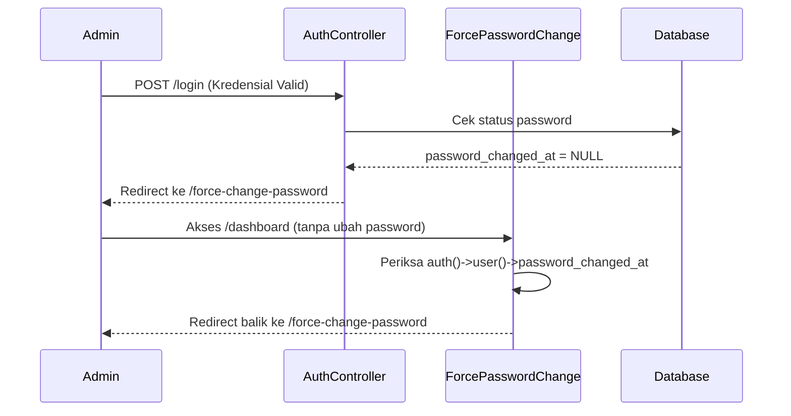

# Laporan Teknis: Person 1 - Backend Database & Authentication
**SISTEM DASHBOARD KEPEGAWAIAN PUSDATIN KEMENPUPR**

Dokumen ini memuat laporan teknis mendalam mengenai perancangan database, skema data, migrasi, pemodelan objek (ORM), serta mekanisme autentikasi dan otorisasi yang ada di dalam sistem. Laporan ini ditujukan sebagai panduan kerja dan dokumentasi bagi **Developer 1 (Person 1 - Backend Database & Auth)**.

---

## 🗄️ 1. Arsitektur & Skema Database (Deep Dive)

Sistem menggunakan database relasional **MySQL (>= 8.0) / MariaDB** dengan struktur tabel terpusat pada tabel utama `pegawai`. Relasi didesain dengan integritas data tinggi menggunakan kunci asing (*foreign keys*) berkaskade (*on update & delete cascade*).

### A. Tabel Utama & Kamus Data Detail

#### 1. Tabel: `pegawai` (Model: [Pegawai](file:///c:/laragon/www/dashboard-kepegawaian/app/Models/Pegawai.php))
Menyimpan profil master pegawai hasil sinkronisasi dari API e-HRM.
*   **Primary Key**: `id_pegawai_api` (varchar(255)) - ID unik dari API pusat e-HRM.
*   **Struktur Kolom**:
    *   `nip` (varchar(50), unique, indexed): Nomor Induk Pegawai.
    *   `nama` (varchar(255)): Nama lengkap beserta gelar.
    *   `email` (varchar(255), nullable): Email kedinasan pegawai (tujuan notifikasi).
    *   `pangkat_golongan` (varchar(50), nullable): Golongan ruang terupdate (contoh: `"III/a"`, `"IV/b"`).
    *   `tmt_pangkat_terakhir` (date, nullable): Tanggal TMT pangkat terakhir.
    *   `tmt_kgb_terakhir` (date, nullable): Tanggal TMT KGB terakhir.
    *   `tipe_jabatan` (varchar(100), nullable): Kategori jabatan (`"Fungsional"`, `"Struktural"`, `"Pelaksana"`, `"Jabatan Lainnya"`).
    *   `jabatan_saat_ini` (text, nullable): Nama lengkap jabatan aktif.
    *   `jenjang` (varchar(100), nullable): Jenjang jabatan fungsional (`"Ahli Pertama"`, `"Ahli Muda"`, dst.).
    *   `jenjang_pendidikan` (varchar(100), nullable): Pendidikan terakhir (contoh: `"S1"`, `"D-III"`).
    *   `kd_eselon` (varchar(10), nullable): Kode eselon (jika struktural).
    *   `arsip_skp_2_tahun` (json, nullable): Menyimpan berkas SKP tahunan dalam format JSON array.

#### 2. Tabel: `dashboard_tracker` (Model: [DashboardTracker](file:///c:/laragon/www/dashboard-kepegawaian/app/Models/DashboardTracker.php))
Tabel transaksional untuk melacak status usulan aktif dan batas target waktu kepegawaian.
*   **Primary Key**: `id` (bigint, auto-increment)
*   **Foreign Key**: `pegawai_id` -> `pegawai.id_pegawai_api` ON UPDATE CASCADE ON DELETE CASCADE.
*   **Struktur Kolom**:
    *   `kategori` (enum): Kategori siklus (`'KGB'`, `'KP_Jafung'`, `'KP_Struktural'`, `'KP_Reguler'`, `'KJ_Jafung'`, `'UKOM'`, `'TUBEL'`, `'DIKLAT'`).
    *   `tanggal_target` (date, nullable): Estimasi waktu pengajuan usulan.
    *   `status_saat_ini` (enum): Status proses (`'Aman'`, `'Mendekati'`, `'Usulan'`, `'Proses'`, `'Upload E-HRM'`, `'Menunggu UKOM'`, `'Menunggu SKP'`, `'Proses Pengaktifan Kembali'`, `'Selesai'`, `'Data Tidak Lengkap'`).
    *   `keterangan` (text, nullable): Penjelasan status atau berkas yang belum dilengkapi.
    *   `dokumen_total` (int): Jumlah berkas yang wajib diunggah.
    *   `dokumen_terupload` (int): Jumlah berkas yang telah berhasil diunggah.
    *   `notified_at` (timestamp, nullable): Tanggal pengiriman email terakhir.
    *   `dikonfirmasi_at` (timestamp, nullable): Tanggal konfirmasi persetujuan admin.

#### 3. Tabel: `kelengkapan_dokumen` (Model: [KelengkapanDokumen](file:///c:/laragon/www/dashboard-kepegawaian/app/Models/KelengkapanDokumen.php))
Menyimpan ceklis dokumen persyaratan fisik.
*   **Primary Key**: `id` (bigint, auto-increment)
*   **Foreign Key**: `dashboard_tracker_id` -> `dashboard_tracker.id` ON DELETE CASCADE.
*   **Struktur Kolom**:
    *   `nip` (varchar(50)): NIP pegawai yang bersangkutan.
    *   `nama_dokumen` (varchar(255)): Nama berkas (contoh: `"SK Pangkat Terakhir"`, `"SK PAK"`, `"SK Tugas Belajar"`).
    *   `is_uploaded` (boolean): `true` jika berkas telah tersedia di server/API, `false` jika belum.
    *   `file_path` (text, nullable): Lokasi fisik file di dalam folder storage lokal `/storage/app/public/...`.

#### 4. Tabel: `ref_matriks_jf` (Model: [RefMatriksJf](file:///c:/laragon/www/dashboard-kepegawaian/app/Models/RefMatriksJf.php))
Tabel referensi statis (kamus) untuk persyaratan angka kredit kenaikan pangkat / jenjang fungsional.
*   **Primary Key**: `id` (int, auto-increment)
*   **Struktur Kolom**:
    *   `jabatan_asal` / `next_jabatan` (varchar(255))
    *   `pangkat_asal` / `next_pangkat` (varchar(50))
    *   `target_ak` (double): Kebutuhan Angka Kredit kumulatif.
    *   `koefisien_tahunan` (double): Nilai standar perolehan AK per tahun.
    *   `is_naik_jenjang` (boolean): Menandakan apakah baris memicu naik jenjang jabatan (membutuhkan UKOM).

---

### B. Relasi Eloquent ORM di Laravel

Pemodelan relasi pada model **[Pegawai](file:///c:/laragon/www/dashboard-kepegawaian/app/Models/Pegawai.php)**:
```php
public function riwayat_jabatan() {
    return $this->hasMany(RiwayatJabatan::class, 'nip', 'nip');
}
public function riwayat_tubel() {
    return $this->hasMany(RiwayatTubel::class, 'nip', 'nip');
}
public function riwayatAngkaKredit() {
    return $this->hasMany(RiwayatAngkaKredit::class, 'id_pegawai_api', 'id_pegawai_api');
}
public function dashboard_tracker() {
    return $this->hasMany(DashboardTracker::class, 'pegawai_id', 'id_pegawai_api');
}
```

---

## 🔐 2. Mekanisme Autentikasi & Otorisasi (Auth & Security)

Sistem menerapkan pengamanan berlapis bagi admin yang mengelola data kepegawaian melalui modul Autentikasi bawaan Laravel yang telah dikustomisasi.

### A. Fitur Ganti Password Paksa (*Force Change Password*)

Untuk alasan keamanan, admin yang baru dibuat wajib mengganti password bawaan (*default*) pada saat pertama kali login sebelum dapat mengakses halaman dashboard utama.



1.  **Middleware [ForcePasswordChange](file:///c:/laragon/www/dashboard-kepegawaian/app/Http/Middleware/ForcePasswordChange.php)**:
    Menghadang setiap request menuju route dashboard jika admin belum melakukan penggantian password (`password_changed_at IS NULL`):
    ```php
    public function handle(Request $request, Closure $next)
    {
        if (Auth::check() && is_null(Auth::user()->password_changed_at)) {
            if (!$request->is('force-change-password*') && !$request->is('logout')) {
                return redirect()->route('password.force-change');
            }
        }
        return $next($request);
    }
    ```
2.  **Controller [AuthController](file:///c:/laragon/www/dashboard-kepegawaian/app/Http/Controllers/AuthController.php)**:
    Menangani aksi validasi password baru (minimal 8 karakter, konfirmasi kecocokan, dan tidak boleh sama dengan username/password lama) kemudian memperbarui kolom `password_changed_at = now()`.

---

### B. Alur Reset Password & Forgot Password

Jika administrator lupa password login, sistem menyediakan alur pemulihan (*recovery*) melalui pengiriman email tautan (*link*) reset password yang aman:
*   Admin memasukkan email pada halaman `/forgot-password`.
*   Sistem memicu method `sendResetLinkEmail` pada `AuthController` untuk men-generate token acak satu kali pakai (*one-time token*) yang disimpan di tabel `password_resets` dengan masa kadaluarsa 60 menit.
*   Email dikirim berisi tautan menuju `/validate-reset-link/{token}`.
*   Setelah token divalidasi, admin dialihkan ke form `/reset-password` untuk memasukkan password baru.

---

### C. Manajemen Multi-Admin & Pembatasan Akses (*Role & Throttling*)

*   **Pencegahan Brute-Force (Throttling)**:
    Untuk mengamankan sistem dari serangan brute force, rute-rute sensitif dilindungi dengan middleware `throttle`:
    *   Penghapusan admin: Maksimal 10 request per menit (`throttle:10,1`).
    *   Pengiriman email notifikasi manual: Maksimal 5 email per menit (`throttle:5,1`).
    *   Pemicu sinkronisasi data API: Maksimal 1 kali per menit (`throttle:1,1`).
*   **CRUD Admin ([AdminController](file:///c:/laragon/www/dashboard-kepegawaian/app/Http/Controllers/AdminController.php))**:
    Mendukung penambahan admin baru, update peran (*Super Admin* / *Admin Biasa*), serta penghapusan admin lama dengan pencatatan otomatis di dalam tabel `logs`.

---

## 💾 3. Pencadangan Database Otomatis (*Database Backup*)

Sistem memiliki modul ekspor database langsung dari panel administrasi guna mengantisipasi kegagalan sistem (*disaster recovery*).
*   **Controller**: **[DatabaseBackupController](file:///c:/laragon/www/dashboard-kepegawaian/app/Http/Controllers/DatabaseBackupController.php)**.
*   **Cara Kerja**:
    Menggunakan perintah sistem CLI `mysqldump` yang dipicu secara aman melalui kode PHP:
    ```php
    $filename = "backup-" . Carbon::now()->format('Y-m-d-H-i-s') . ".sql";
    $command = sprintf(
        'mysqldump --user=%s --password=%s --host=%s %s > %s',
        escapeshellarg(config('database.connections.mysql.username')),
        escapeshellarg(config('database.connections.mysql.password')),
        escapeshellarg(config('database.connections.mysql.host')),
        escapeshellarg(config('database.connections.mysql.database')),
        storage_path("app/backups/{$filename}")
    );
    ```
    File biner hasil ekspor dibungkus dan langsung ditransmisikan ke browser admin sebagai unduhan file `.sql`. Akses dibatasi ketat hanya untuk admin yang telah terautentikasi.
