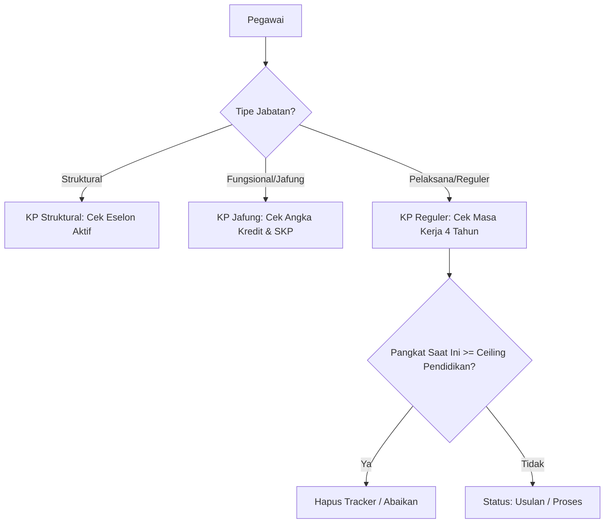

# Laporan Teknis: Person 2 - Backend Manajemen Import/Export & Tracker Engine
**SISTEM DASHBOARD KEPEGAWAIAN PUSDATIN KEMENPUPR**

Dokumen ini memuat laporan teknis mendalam mengenai mekanisme sinkronisasi data dari API e-HRM eksternal, implementasi console commands, serta logika mesin kalkulasi (*tracker engines*) untuk KGB, Kenaikan Pangkat, Kenaikan Jenjang, Ukom, dan Tugas Belajar. Laporan ini disusun untuk **Developer 2 (Person 2 - Backend Import/Export & Tracker)**.

---

## 📡 1. Integrasi API e-HRM & Mekanisme Sinkronisasi (Import Data)

Aplikasi melakukan integrasi dengan server API pusat e-HRM Kementerian PUPR melalui HTTP request menggunakan Client HTTP Laravel (`Http::withHeaders()`). Untuk performa dan keamanan, sinkronisasi dibagi menjadi 5 tahap sekuensial.

### A. Alur Teknis Sinkronisasi 5 Tahap

Mekanisme ini diimplementasikan pada file **[SyncEhrmData.php](file:///c:/laragon/www/dashboard-kepegawaian/app/Console/Commands/SyncEhrmData.php)**:

1.  **Tahap 1: Sinkronisasi Profil Dasar (`syncPegawai`)**
    *   Endpoint: `GET /pegawai`
    *   Mengambil data profil dasar seperti NIP, Nama, Email, TMT Pangkat, TMT KGB, Golongan Ruang, Tipe Jabatan, dan Pendidikan Terakhir.
    *   **Penting**: Field `pendidikan` dari JSON dipetakan langsung ke kolom `jenjang_pendidikan` pada tabel lokal `pegawai` untuk memvalidasi batas atas kenaikan pangkat reguler.
2.  **Tahap 2: Sinkronisasi Riwayat Diklat (`syncDiklat`)**
    *   Endpoint: `GET /riwayat-diklat/{nip}`
    *   Mengambil daftar diklat fungsional/teknis pegawai untuk pemantauan wajib diklat (misal diklat kepemimpinan atau diklat jabatan fungsional).
3.  **Tahap 3: Sinkronisasi Riwayat Angka Kredit (`syncAngkaKredit`)**
    *   Endpoint: `GET /riwayat-angka-kredit/{nip}`
    *   Mengambil data PAK (*Penetapan Angka Kredit*) terakhir pegawai Jafung untuk kalkulasi kenaikan pangkat/jenjang.
4.  **Tahap 4: Sinkronisasi Riwayat Tugas Belajar (`syncTubel`)**
    *   Endpoint: `GET /riwayat-tubel/{nip}`
    *   Mengambil berkas surat keputusan tugas belajar, perpanjangan, serta memetakan file lampiran `arsip_izin_belajar` langsung ke kelengkapan dokumen lokal.
5.  **Tahap 5: Sinkronisasi Riwayat Jabatan (`syncJabatan`)**
    *   Endpoint: `GET /riwayat-jabatan/{nip}`
    *   Mengambil daftar riwayat jabatan untuk memvalidasi eselon aktif serta file SK jabatan terakhir (`arsip` jabatan) untuk kebutuhan kenaikan pangkat struktural dan kenaikan jenjang.

---

## ⚡ 2. Console Commands & Background Scheduler

Aplikasi memiliki dua perintah latar belakang utama yang dapat dijalankan secara manual via CLI atau terjadwal otomatis di server:

1.  **`php artisan ehrm:sync` ([SyncEhrmData.php](file:///c:/laragon/www/dashboard-kepegawaian/app/Console/Commands/SyncEhrmData.php))**
    *   Melakukan unduh data massal dari API e-HRM.
    *   Secara cerdas mengidentifikasi file berkas lampiran yang sudah terunggah di API (seperti berkas SK Jabatan Terakhir atau SK Tugas Belajar) dan memperbarui tabel lokal `kelengkapan_dokumen` dengan status `is_uploaded = true` agar admin tidak perlu mengunggah berkas tersebut secara manual lagi.
2.  **`php artisan tracker:run` ([RecalculateTracker.php](file:///c:/laragon/www/dashboard-kepegawaian/app/Console/Commands/RecalculateTracker.php))**
    *   Berperan sebagai *orchestrator* yang memicu kalkulasi ulang pada seluruh data pegawai.
    *   Mengeksekusi *Tracker Services* secara bergantian untuk memindai pencapaian target/milestone setiap pegawai.

---

## 🧠 3. Logika Bisnis Tracker Services (`app/Services/Tracker`)

Setiap tracker service bertugas menganalisis data riwayat pegawai dan menentukan apakah pegawai tersebut masuk dalam daftar usulan, aman, atau memerlukan unggah dokumen.

### A. KgbTrackerService ([KgbTrackerService.php](file:///c:/laragon/www/dashboard-kepegawaian/app/Services/Tracker/KgbTrackerService.php))
*   **Rumus Target**: $\text{Target KGB} = \text{TMT KGB Terakhir} + 2\text{ Tahun}$.
*   **Logika Notifikasi**:
    *   Jarak ke target $> 60$ hari $\rightarrow$ Status `Aman` (Tracker dihapus dari DB agar bersih).
    *   Jarak ke target $\le 60$ hari $\rightarrow$ Status `Usulan`. Sistem mengirim notifikasi email dan mendaftarkan di dashboard.
    *   Admin menyetujui $\rightarrow$ Status `Upload E-HRM`. Sistem mengirim instruksi email agar pegawai mengunggah SK KGB baru ke e-HRM.

---

### B. KenaikanPangkatService ([KenaikanPangkatService.php](file:///c:/laragon/www/dashboard-kepegawaian/app/Services/Tracker/KenaikanPangkatService.php))
Memproses tiga kategori kenaikan pangkat secara bersamaan:

1.  **Kenaikan Pangkat Struktural**:
    Mendeteksi kesesuaian pangkat terendah/tertinggi berdasarkan eselon aktif pegawai (diambil dari `kd_eselon` di riwayat jabatan terakhir).
2.  **Kenaikan Pangkat Fungsional**:
    Mencocokkan jumlah Angka Kredit (AK) kumulatif pegawai saat ini dengan target AK minimal pada matriks referensi [RefMatriksJf](file:///c:/laragon/www/dashboard-kepegawaian/app/Models/RefMatriksJf.php). Mengecek kepatuhan nilai SKP Tahunan 2 tahun terakhir (harus berpredikat minimal **BAIK**).
3.  **Kenaikan Pangkat Reguler (Pelaksana) & Batasan Ceiling Pendidikan**:
    *   KP reguler berulang setiap 4 tahun sekali (48 bulan) berdasarkan `tmt_pangkat_terakhir`.
    *   **Aturan Ceiling Golongan**: Golongan pangkat dibatasi ketat oleh ijazah terakhir pegawai. Diimplementasikan pada method `getMaxGolonganReguler()`:
        *   `SD` $\rightarrow$ Batas maksimum: **II/a**
        *   `SLTP / SMP` $\rightarrow$ Batas maksimum: **II/c**
        *   `SLTA / SMA / SMK` $\rightarrow$ Batas maksimum: **III/b**
        *   `Diploma II (D-II)` $\rightarrow$ Batas maksimum: **III/b**
        *   `Diploma III (D-III)` $\rightarrow$ Batas maksimum: **III/c**
        *   `S-1 / Diploma IV (D-IV)` $\rightarrow$ Batas maksimum: **III/d**
        *   `S-2 / Magister` $\rightarrow$ Batas maksimum: **IV/a**
        *   `S-3 / Doktor` $\rightarrow$ Batas maksimum: **IV/b**
    *   Jika pangkat saat ini pegawai pelaksana sudah mencapai atau melewati golongan ceiling di atas, sistem secara otomatis **menghapus** tracker `KP_Reguler` agar tidak membanjiri antrean dashboard admin.

---

### C. KenaikanJenjangService ([KenaikanJenjangService.php](file:///c:/laragon/www/dashboard-kepegawaian/app/Services/Tracker/KenaikanJenjangService.php))
*   Melacak pegawai fungsional yang perolehan Angka Kreditnya sudah melampaui target perpindahan jenjang jabatan (misal dari Ahli Pertama ke Ahli Muda).
*   Sistem mengarahkan pegawai untuk mengikuti Uji Kompetensi (`UKOM`) terlebih dahulu.
*   Status tracker akan berganti ke `Menunggu UKOM` $\rightarrow$ `UKOM Proses` $\rightarrow$ (Setelah Admin mengonfirmasi kelulusan) berubah menjadi usulan `KJ_Jafung` (Kenaikan Jenjang Jabatan).

---

### D. TubelService ([TubelService.php](file:///c:/laragon/www/dashboard-kepegawaian/app/Services/Tracker/TubelService.php))
*   Memantau masa tugas belajar PNS karyasiswa yang sedang aktif kuliah.
*   Jika tanggal selesai studi berjarak $\le 60$ hari dari tanggal saat ini, status tracker otomatis beralih menjadi `Proses Pengaktifan`.
*   Sistem secara otomatis memicu notifikasi email berkala agar pegawai segera menyiapkan berkas administrasi pengaktifan kembali ke dinas aktif.
*   **Pencegahan Reset Status**: Menambahkan filter khusus agar tracker yang sudah berstatus `"Selesai"` (telah divalidasi admin) tidak ditimpa kembali menjadi status aktif `"Sedang Tubel"` pada kalkulasi harian berikutnya.
